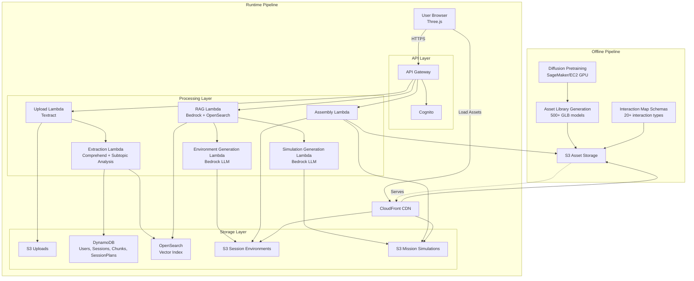
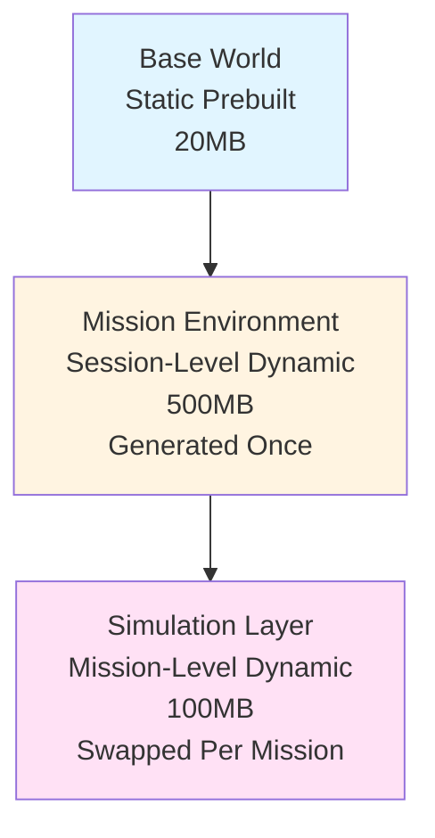
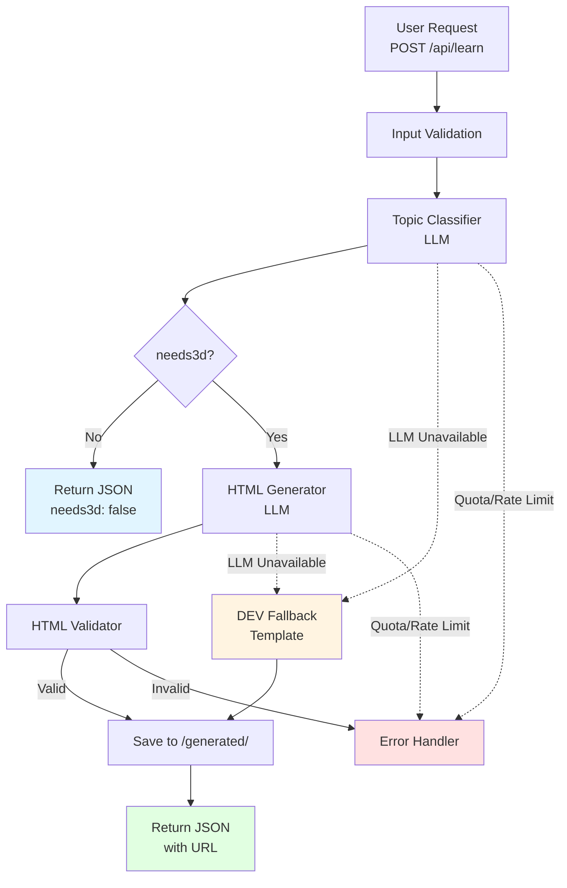

# Design Document: AI-Powered 3D Educational Web Platform

## Overview

This design document specifies the technical architecture for an AI-powered 3D educational web platform that transforms PDF documents into interactive 3D learning experiences. The system follows a hybrid architecture with heavy offline processing for asset generation and lightweight runtime processing for content retrieval and mission assembly.

### Core Architecture Principles

1. **Offline-First Asset Generation**: All computationally expensive operations (diffusion model training, 3D asset generation, scene template creation) occur offline
2. **Retrieval-Composition Pattern**: Runtime prioritizes retrieving and composing pre-generated assets over real-time generation
3. **Multilingual by Design**: Content extraction, storage, and retrieval support multiple languages with on-demand translation
4. **Latency-Bounded Operations**: Strict timing constraints ensure responsive user experience (retrieval < 2s, assembly < 5s typical, fallback max 20s)
5. **Horizontal Scalability**: Serverless architecture supports 1000+ concurrent sessions

### System Boundaries

**Offline Pipeline** (Pre-runtime):
- Diffusion model pretraining on 3D asset datasets
- Asset library generation (500+ GLB models, 50+ scene templates)
- Interaction map schema definition

**Runtime Pipeline** (User-facing):
- PDF upload and processing
- Knowledge extraction with multilingual support and subtopic identification
- RAG-based content retrieval
- Session-level Mission Environment generation (once per session)
- Mission-level Simulation Layer generation (per mission)
- AI-driven JSON generation (EnvironmentPlan, SimulationPlan, TeachContent, QuizPlan, InteractionMap)
- Mission assembly from pre-generated assets
- 3D rendering with Three.js
- Interactive teaching and quiz modes

### Architectural Layers

The system operates on three distinct 3D layers:

**Layer 1: Base World** (Static, Prebuilt)
- Loaded once at application start
- Provides foundational 3D space
- Never changes during runtime
- Size: < 20MB

**Layer 2: Mission Environment** (Dynamic, Session-Level)
- Generated once per session based on dominant PDF topic
- Persists across all missions in the session
- Loaded into GPU memory at session start
- Remains loaded until session end
- Size: < 500MB
- Examples: biology_lab, history_museum, physics_workshop

**Layer 3: Simulation Layer** (Dynamic, Mission-Level)
- Generated per mission based on subtopic
- Injected into Mission Environment
- Swapped between missions
- Fully unloadable
- Size: < 100MB per mission
- Contains: simulation assets, interactions, content


## Architecture

### High-Level System Architecture



### Three-Layer Architecture



### Component Responsibilities

**Offline Components:**
- **Diffusion Pretraining**: Train stable diffusion models on 3D asset datasets using SageMaker or EC2 GPU instances
- **Asset Library Generator**: Create reusable 3D models (GLB format) with consistent style, scale, and optimization
- **Interaction Schema Designer**: Define JSON schemas for 20+ interaction types (click, hover, drag, proximity, gaze)

**Runtime Components:**
- **API Gateway**: REST API endpoint management, request routing, rate limiting (100 req/s per user)
- **Cognito**: User authentication, JWT token management, session tracking
- **Upload Lambda**: PDF processing with Textract, file validation, S3 storage
- **Extraction Lambda**: Content chunking (200-500 words), language detection with Comprehend, concept extraction, subtopic identification
- **RAG Lambda**: Vector search with OpenSearch, chunk retrieval, relevance ranking
- **Environment Generation Lambda**: LLM-based EnvironmentPlan generation for session-level Mission Environment using Bedrock
- **Simulation Generation Lambda**: LLM-based SimulationPlan, TeachContent, QuizPlan, InteractionMap generation per mission using Bedrock
- **Assembly Lambda**: Environment and simulation composition from Asset Library, Interaction Map injection, caching
- **DynamoDB**: Structured data storage (users, sessions, documents, chunks, session plans, mission cache metadata)
- **OpenSearch**: Vector embeddings (768 dimensions), semantic search, multilingual support
- **S3**: Object storage for uploads, assets, session environments, mission simulations, with lifecycle policies
- **CloudFront**: CDN for asset distribution, 7-day browser caching, 99.9% availability


## Offline Pipeline

### Stage O1: Diffusion Model Pretraining

**Objective**: Train stable diffusion models capable of generating 3D assets in GLB format.

**Process**:
1. Curate training dataset of 10,000+ high-quality 3D models from open sources (Sketchfab, Poly Haven)
2. Preprocess models: normalize scale, center origin, optimize polygon count (< 50k triangles)
3. Train diffusion model using SageMaker with GPU instances (p3.8xlarge or higher)
4. Validate generated assets for format compliance, visual quality, and file size (< 5MB)
5. Store trained model weights in S3 for offline asset generation

**Technology Stack**:
- SageMaker Training Jobs with PyTorch
- Stable Diffusion 3D variants (Shap-E, Point-E)
- S3 for model storage
- CloudWatch for training metrics

**Output**: Trained diffusion model capable of generating diverse 3D assets

### Stage O2: Asset Library Generation

**Objective**: Create a comprehensive library of 500+ reusable 3D assets and 50+ scene templates.

**Process**:
1. Define asset categories: characters, objects, environments, UI elements, effects
2. Generate assets using trained diffusion model with category-specific prompts
3. Post-process assets: apply PBR materials, add LOD levels, compress with Draco
4. Create scene templates: pre-composed environments with lighting, camera positions, and placeholder asset slots
5. Validate all assets: GLB format compliance, file size limits, visual consistency
6. Upload to S3 with metadata tags (category, style, dimensions, polygon count)
7. Enable CloudFront distribution with cache headers

**Asset Organization**:
```
/assets/
  /characters/
    character_001.glb
    character_002.glb
  /objects/
    object_001.glb
    object_002.glb
  /environments/
    environment_001.glb
    environment_002.glb
  /templates/
    template_001.json (references assets)
    template_002.json
```

**Technology Stack**:
- AWS Batch for parallel asset generation
- Python scripts with trimesh, pygltflib for processing
- S3 for storage with versioning enabled
- CloudFront for CDN distribution

**Output**: Asset Library with 500+ GLB models, 50+ scene templates, metadata index

### Stage O3: Interaction Map Schema Definition

**Objective**: Define standardized JSON schemas for interaction mechanics.

**Process**:
1. Identify 20+ interaction types from requirements and UX research
2. Define JSON schema for each interaction type with required/optional fields
3. Create validation rules and example payloads
4. Document interaction behavior specifications
5. Store schemas in S3 and version control

**Interaction Types**:
- Click: Single click on hotspot triggers action
- Hover: Mouse hover displays tooltip or highlight
- Drag: Drag object to new position or target
- Proximity: Avatar entering region triggers event
- Gaze: Looking at object for duration triggers action
- Multi-touch: Pinch, rotate, swipe gestures
- Voice: Voice command triggers action (optional)

**Schema Structure**:
```json
{
  "interaction_type": "click",
  "required_fields": ["hotspot_id", "position", "action"],
  "optional_fields": ["tooltip", "animation", "sound"],
  "validation_rules": {
    "position": "array of 3 floats",
    "action": "enum: [show_content, navigate, trigger_quiz]"
  }
}
```

**Output**: Interaction Library with 20+ interaction type schemas, validation rules, documentation


## Runtime Pipeline

### Stage 0: PDF Upload

**Objective**: Accept PDF upload, validate, and store securely.

**Process**:
1. User uploads PDF via POST /upload endpoint (multipart/form-data)
2. API Gateway validates file size (100KB - 50MB), content type (application/pdf)
3. Upload Lambda generates unique document_id (UUID)
4. Lambda uploads PDF to S3 with encryption (AES-256) at path /uploads/{user_id}/{document_id}.pdf
5. Lambda returns document_id to client
6. Lambda triggers Extraction Lambda asynchronously

**API Contract**:
```
POST /upload
Content-Type: multipart/form-data

Request:
- file: PDF binary

Response (200):
{
  "document_id": "uuid",
  "status": "processing",
  "estimated_time_seconds": 60
}

Response (400):
{
  "error_code": "INVALID_FILE_SIZE",
  "message": "File size must be between 100KB and 50MB"
}
```

**Technology**: API Gateway, Lambda (Node.js or Python), S3

### Stage 1: Content Ingestion, Multilingual Processing, and Subtopic Identification

**Objective**: Extract text, detect language, chunk content, generate embeddings, and identify subtopics.

**Process**:
1. Extraction Lambda retrieves PDF from S3
2. Lambda invokes Textract to extract text with layout preservation
3. Lambda uses Comprehend to detect language for entire document
4. Lambda segments content into chunks (200-500 words) at semantic boundaries (paragraphs, sections)
5. For each chunk:
   - Detect chunk-level language with Comprehend (handles multi-language PDFs)
   - Extract 3+ key concepts using Bedrock LLM with prompt: "Extract key concepts from: {chunk_text}"
   - Generate multilingual embedding (768 dimensions) using Bedrock Titan Embeddings
6. Lambda stores chunks in DynamoDB with attributes:
   - chunk_id (UUID)
   - document_id
   - content (text)
   - language_code (ISO 639-1)
   - concept_tags (array of strings)
   - position (page number, order)
   - metadata (heading, section)
7. Lambda indexes embeddings in OpenSearch with chunk_id reference
8. **Lambda analyzes all chunks to identify 4-5 distinct subtopics**:
   - Use Bedrock LLM with prompt: "Analyze this document and identify 4-5 distinct subtopics with titles and learning objectives"
   - Ensure subtopics are semantically distinct
   - Determine dominant topic across all subtopics for environment selection
9. Lambda stores subtopics in DynamoDB SessionPlan structure
10. Lambda updates document status to "ready" in DynamoDB

**Subtopic Identification Prompt**:
```
Analyze the following educational content and identify 4-5 distinct subtopics.

Content: {all_chunks_summary}

For each subtopic, provide:
- title: Clear, descriptive title
- learning_objectives: Array of 2-3 specific learning goals
- dominant_topic: Overall category (e.g., "biology", "history", "physics")

Output JSON:
{
  "subtopics": [
    {
      "title": "Introduction to Cells",
      "learning_objectives": ["Understand cell structure", "Identify cell types"],
      "chunk_refs": ["chunk_id_1", "chunk_id_2"]
    }
  ],
  "dominant_topic": "biology"
}
```

**DynamoDB Schema (Chunks Table)** - unchanged

**DynamoDB Schema (SessionPlans Table)**:
```json
{
  "session_plan_id": "uuid",
  "document_id": "uuid",
  "dominant_topic": "biology",
  "subtopics": [
    {
      "subtopic_id": "uuid",
      "title": "Introduction to Cells",
      "learning_objectives": ["Understand cell structure", "Identify cell types"],
      "chunk_refs": ["chunk_id_1", "chunk_id_2"]
    }
  ],
  "created_at": "ISO8601 timestamp"
}
```

**OpenSearch Index Schema** - unchanged

**Technology**: Lambda (Python), Textract, Comprehend, Bedrock (Titan Embeddings, Claude for concept extraction and subtopic analysis), DynamoDB, OpenSearch

### Stage 2.0: Prompt Cache Implementation

**Objective**: Reduce latency and LLM costs by caching mission packages for similar prompts.

**Process**:
1. When mission generation is requested, generate prompt embedding using Bedrock Titan Embeddings
2. Query MissionCache index in OpenSearch for similar prompts (cosine similarity)
3. If similarity > threshold (default 0.70):
   - Retrieve cached mission package from S3
   - Return cached mission within 1 second
   - Log cache hit
4. If similarity < threshold:
   - Proceed to Stage 2 (full RAG + generation)
   - After generation, store mission package in S3
   - Index prompt embedding in MissionCache
   - Log cache miss

**MissionCache Index Schema**:
```json
{
  "cache_id": "uuid",
  "prompt_embedding": [768 floats],
  "mission_package_s3_key": "s3://bucket/missions/...",
  "document_id": "uuid",
  "ui_language": "en",
  "created_at": "ISO8601 timestamp",
  "hit_count": 0
}
```

**Cache Invalidation**:
- Manual invalidation via admin API: DELETE /admin/cache/{cache_id}
- Automatic expiration after 24 hours
- Invalidation on document update

**Technology**: Lambda, Bedrock Titan Embeddings, OpenSearch, S3

### Stage 2.1: Session Environment Generation

**Objective**: Generate a persistent Mission Environment for the entire session based on dominant topic.

**Process**:
1. User requests session creation via POST /sessions with document_id and ui_language
2. Lambda retrieves SessionPlan from DynamoDB to get dominant_topic and subtopics
3. Lambda constructs environment generation prompt:
   ```
   Generate a 3D environment suitable for learning about {dominant_topic}.
   
   The environment should:
   - Support {number_of_subtopics} different learning activities
   - Be educationally appropriate
   - Provide spatial zones for different activities
   - Include ambient elements that reinforce the topic
   
   Output EnvironmentPlan JSON with:
   - environment_id
   - environment_type (e.g., "biology_lab", "history_museum")
   - assets: array of environment assets with positions
   - spatial_zones: array of zones for mission activities
   - lighting: ambient and directional lighting
   - camera_start_position
   ```
4. Lambda invokes Bedrock LLM (Claude 3) to generate EnvironmentPlan
5. Lambda validates EnvironmentPlan against schema
6. For each asset in EnvironmentPlan:
   - Verify asset exists in Asset Library
   - If missing and partial diffusion enabled, trigger asset generation (within 20s budget)
   - If missing and partial diffusion disabled, use fallback placeholder
7. Lambda validates environment constraints:
   - Total polygon count < 2M triangles
   - Total memory budget < 500MB
   - All assets under 5MB each
8. Lambda stores EnvironmentPlan at /sessions/{session_id}/environment/ in S3
9. Lambda updates SessionPlan with environment_id
10. Lambda returns session_id, environment_id, and mission_ids to client

**EnvironmentPlan Schema**:
```json
{
  "environment_id": "uuid",
  "schema_version": "1.0.0",
  "environment_type": "biology_lab",
  "assets": [
    {
      "asset_id": "lab_table_001",
      "cdn_url": "https://cdn.../lab_table_001.glb",
      "position": [0, 0, 0],
      "rotation": [0, 0, 0],
      "scale": [1, 1, 1],
      "is_environment": true
    }
  ],
  "spatial_zones": [
    {
      "zone_id": "zone_1",
      "purpose": "microscopy_station",
      "bounds": {"min": [-5, 0, -5], "max": [5, 3, 5]},
      "camera_position": [0, 2, 8]
    }
  ],
  "lighting": {
    "ambient": {"color": "#ffffff", "intensity": 0.6},
    "directional": {"color": "#ffffff", "intensity": 0.8, "position": [10, 10, 10]}
  },
  "camera_start_position": [0, 5, 15]
}
```

**API Contract**:
```
POST /sessions
Content-Type: application/json

Request:
{
  "document_id": "uuid",
  "ui_language": "en"
}

Response (200):
{
  "session_id": "uuid",
  "environment_id": "uuid",
  "environment_type": "biology_lab",
  "mission_ids": ["uuid1", "uuid2", "uuid3", "uuid4"],
  "estimated_duration_minutes": 30
}
```

**Latency Budget**:
- Environment generation: < 15s
- Asset verification: < 3s
- Validation: < 1s
- Storage: < 1s
- Total: < 20s maximum

**Technology**: Lambda (Python), Bedrock (Claude 3), S3, DynamoDB, Asset Library


### Stage 2: RAG and Simulation Layer Generation

**Objective**: Retrieve relevant content and generate Simulation Layer for each mission.

**Process**:
1. For each subtopic in the SessionPlan, generate a Simulation Layer
2. RAG Lambda generates query embedding for subtopic context
3. Lambda performs vector search in OpenSearch:
   - Retrieve top 10 chunks by cosine similarity
   - Apply configurable threshold (default 0.65)
   - Prioritize chunks matching ui_language
   - Filter to chunks referenced in subtopic.chunk_refs
4. If no chunks meet threshold, return error
5. For chunks in different language than ui_language:
   - Invoke Amazon Translate for on-demand translation
   - Cache translated chunks in DynamoDB with TTL (24 hours)
6. Lambda constructs context from retrieved chunks
7. Lambda invokes Bedrock LLM (Claude 3) to generate Simulation Layer components:
   - **SimulationPlan**: Simulation-specific assets and their positions within environment zones
   - **TeachContent**: Structured explanations in ui_language
   - **QuizPlan**: 3-5 questions with rubrics
   - **InteractionMap**: Hotspots, regions, collision proxies for simulation
8. Lambda validates each JSON against predefined schemas
9. If validation fails, retry generation up to 3 times
10. Lambda stores Simulation Layer at /missions/{document_id}/{mission_id}/ in S3
11. Lambda creates mission record in DynamoDB

**SimulationPlan Schema**:
```json
{
  "simulation_id": "uuid",
  "schema_version": "1.0.0",
  "subtopic_id": "uuid",
  "simulation_assets": [
    {
      "asset_id": "microscope_001",
      "cdn_url": "https://cdn.../microscope_001.glb",
      "position": [0, 1, 0],
      "rotation": [0, 0, 0],
      "scale": [1, 1, 1],
      "zone_id": "zone_1",
      "is_simulation": true
    }
  ],
  "camera_focus": [0, 2, 8]
}
```

**LLM Prompt Template (SimulationPlan)**:
```
You are generating a simulation layer for an educational mission.

Environment: {environment_type}
Available Zones: {spatial_zones}
Subtopic: {subtopic_title}
Learning Objectives: {learning_objectives}
Context: {retrieved_chunks}
UI Language: {ui_language}

Generate a JSON SimulationPlan with:
- simulation_id: unique identifier
- simulation_assets: array of {asset_id, position [x,y,z], rotation [x,y,z], scale [x,y,z], zone_id}
- camera_focus: [x,y,z] position for this mission

Use assets from the Asset Library. Reference asset IDs like "microscope_001", "cell_model_042".
Place assets within the specified zones.
Ensure simulation is educationally relevant to the subtopic.
Total simulation assets must not exceed 100MB.

Output only valid JSON.
```

**Technology**: Lambda (Python), Bedrock (Titan Embeddings, Claude 3), OpenSearch, Amazon Translate, DynamoDB, S3


### Stage 3: Base World and Mission Environment Loading

**Objective**: Load static Base World and session-level Mission Environment in user's browser.

**Process**:
1. User's browser initializes Three.js WebGL 2.0 renderer
2. Browser requests Base World GLB from CloudFront CDN
3. Three.js GLTFLoader loads Base World (< 20MB) with Draco decompression
4. Renderer initializes scene with:
   - PBR materials with environment mapping
   - Ambient + directional lighting
   - Camera with orbit controls (orbit, pan, zoom)
   - Skybox or environment texture
5. Browser displays loading progress indicator
6. **Browser requests Mission Environment from GET /sessions/{session_id}/environment**
7. **Browser loads Mission Environment assets from CDN**
8. **Browser overlays Mission Environment onto Base World**:
   - Add environment assets to scene
   - Configure spatial zones
   - Set environment lighting
   - Position camera at environment start position
9. **Browser keeps Mission Environment loaded in GPU memory (< 500MB)**
10. Browser enables user navigation in combined Base World + Mission Environment
11. Browser requests first mission Simulation Layer

**Three.js Initialization** - unchanged from previous version

**Mission Environment Loading**:
```javascript
async function loadMissionEnvironment(sessionId) {
  // Get environment plan
  const response = await fetch(`/sessions/${sessionId}/environment`);
  const envPlan = await response.json();
  
  // Load environment assets
  const loader = new GLTFLoader();
  const dracoLoader = new DRACOLoader();
  loader.setDRACOLoader(dracoLoader);
  
  const environmentGroup = new THREE.Group();
  environmentGroup.name = 'mission_environment';
  environmentGroup.userData.persistent = true;  // Mark as persistent
  
  for (const asset of envPlan.assets) {
    const gltf = await loader.loadAsync(asset.cdn_url);
    gltf.scene.position.set(...asset.position);
    gltf.scene.rotation.set(...asset.rotation);
    gltf.scene.scale.set(...asset.scale);
    gltf.scene.userData.isEnvironment = true;
    environmentGroup.add(gltf.scene);
  }
  
  scene.add(environmentGroup);
  
  // Store spatial zones for simulation placement
  window.spatialZones = envPlan.spatial_zones;
  
  // Update lighting
  updateLighting(envPlan.lighting);
  
  // Position camera
  camera.position.set(...envPlan.camera_start_position);
  
  console.log('Mission Environment loaded and will persist for session');
  return envPlan.environment_id;
}
```

**Performance Optimizations**:
- Frustum culling: Only render objects in camera view
- LOD (Level of Detail): Switch to lower-poly models at distance
- Texture compression: Use KTX2 format for textures
- Instanced rendering: Reuse geometry for repeated objects
- GPU memory monitoring: Track usage to stay under 500MB budget

**Technology**: Three.js, GLTFLoader, DRACOLoader, OrbitControls, CloudFront CDN

### Stage 4: Simulation Layer Assembly and Injection

**Objective**: Compose Simulation Layer from pre-generated assets and inject into Mission Environment.

**Process**:
1. Browser requests mission via GET /missions/{mission_id}
2. Assembly Lambda retrieves Simulation Layer from S3 (SimulationPlan, TeachContent, QuizPlan, InteractionMap)
3. Lambda validates all JSON against schemas
4. For each asset in SimulationPlan:
   - Verify asset exists in Asset Library
   - If missing and partial diffusion enabled, trigger asset generation (max 20s)
   - If missing and partial diffusion disabled, use fallback placeholder asset
5. Lambda injects Interaction Map into SimulationPlan:
   - Add hotspot metadata to simulation asset references
   - Define collision proxies for navigation constraints
   - Specify region boundaries within zones
6. Lambda packages Simulation Layer data and returns to browser
7. **Browser unloads previous Simulation Layer (if any)**:
   - Remove simulation assets from scene
   - Dispose geometries and materials
   - Clear interaction handlers
8. **Browser loads new Simulation Layer assets from CDN**
9. **Browser injects Simulation Layer into Mission Environment**:
   - Add simulation assets to appropriate spatial zones
   - Initialize interaction handlers from Interaction Map
   - Position camera at simulation focus point
10. **Browser does NOT reload or modify Mission Environment**
11. **Browser does NOT reset WebGL context**

**API Contract**:
```
GET /missions/{mission_id}

Response (200):
{
  "mission_id": "uuid",
  "subtopic": {
    "title": "Introduction to Cells",
    "learning_objectives": ["Understand cell structure", "Identify cell types"]
  },
  "simulation_plan": {
    "simulation_id": "uuid",
    "simulation_assets": [
      {
        "asset_id": "microscope_001",
        "cdn_url": "https://cdn.../microscope_001.glb",
        "position": [0, 1, 0],
        "rotation": [0, 0, 0],
        "scale": [1, 1, 1],
        "zone_id": "zone_1",
        "hotspot": {
          "id": "hotspot_1",
          "type": "click",
          "action": "show_content",
          "content_ref": "teach_section_1"
        }
      }
    ],
    "camera_focus": [0, 2, 8]
  },
  "teach_content": {
    "content_id": "uuid",
    "language_code": "en",
    "sections": [...]
  },
  "quiz_plan": {
    "quiz_id": "uuid",
    "questions": [...]
  },
  "interaction_map": {
    "map_id": "uuid",
    "hotspots": [...],
    "regions": [...],
    "collision_proxies": [...]
  }
}
```

**Simulation Layer Injection**:
```javascript
async function injectSimulationLayer(missionId) {
  // Unload previous simulation
  unloadSimulationLayer();
  
  // Get simulation data
  const response = await fetch(`/missions/${missionId}`);
  const mission = await response.json();
  
  // Load simulation assets
  const loader = new GLTFLoader();
  const simulationGroup = new THREE.Group();
  simulationGroup.name = 'simulation_layer';
  simulationGroup.userData.persistent = false;  // Mark as temporary
  
  for (const asset of mission.simulation_plan.simulation_assets) {
    const gltf = await loader.loadAsync(asset.cdn_url);
    gltf.scene.position.set(...asset.position);
    gltf.scene.rotation.set(...asset.rotation);
    gltf.scene.scale.set(...asset.scale);
    gltf.scene.userData.isSimulation = true;
    gltf.scene.userData.zoneId = asset.zone_id;
    
    // Setup hotspot if present
    if (asset.hotspot) {
      setupHotspot(gltf.scene, asset.hotspot);
    }
    
    simulationGroup.add(gltf.scene);
  }
  
  scene.add(simulationGroup);
  
  // Position camera at simulation focus
  camera.position.set(...mission.simulation_plan.camera_focus);
  
  // Initialize interactions
  initializeInteractions(mission.interaction_map);
  
  console.log('Simulation Layer injected, Environment persists');
}

function unloadSimulationLayer() {
  const simulationGroup = scene.getObjectByName('simulation_layer');
  if (!simulationGroup) return;
  
  // Dispose all simulation assets
  simulationGroup.traverse((obj) => {
    if (obj.geometry) obj.geometry.dispose();
    if (obj.material) {
      if (Array.isArray(obj.material)) {
        obj.material.forEach(mat => mat.dispose());
      } else {
        obj.material.dispose();
      }
    }
  });
  
  scene.remove(simulationGroup);
  
  // Clear interaction handlers
  clearInteractionHandlers();
  
  console.log('Simulation Layer unloaded, Environment persists');
}
```

**Latency Budget**:
- Retrieve simulation data: < 1s
- Validate schemas: < 500ms
- Verify assets: < 1s
- Unload previous simulation: < 500ms
- Load new simulation assets: < 2s
- Inject and initialize: < 500ms
- Total: < 5s

**Technology**: Lambda (Python), S3, CloudFront, JSON Schema validation, Three.js


### Stage 5: Teach Mode

**Objective**: Present interactive teaching content with zero evaluation.

**Process**:
1. Browser enters Teach Mode after mission assets load
2. Browser displays Teach Content sections in UI overlay
3. User can:
   - Click hotspots to reveal content
   - Navigate 3D scene freely
   - Read explanations at own pace
   - Interact with 3D objects (rotate, zoom)
4. No scoring, attempt logging, or time limits
5. User clicks "Ready for Quiz" button to proceed
6. Browser transitions to Quiz Mode

**UI Implementation**:
```javascript
class TeachMode {
  constructor(teachContent, interactionMap, scene) {
    this.teachContent = teachContent;
    this.interactionMap = interactionMap;
    this.scene = scene;
    this.currentSection = 0;
  }
  
  initialize() {
    // Display first section
    this.displaySection(this.teachContent.sections[0]);
    
    // Setup hotspot interactions
    this.interactionMap.hotspots.forEach(hotspot => {
      this.setupHotspot(hotspot);
    });
    
    // Enable free navigation
    this.enableNavigation();
  }
  
  setupHotspot(hotspot) {
    const mesh = this.scene.getObjectByName(hotspot.id);
    if (!mesh) return;
    
    // Add click handler
    mesh.userData.clickHandler = () => {
      if (hotspot.action === 'show_content') {
        const section = this.teachContent.sections.find(
          s => s.section_id === hotspot.content_ref
        );
        this.displaySection(section);
      }
    };
    
    // Add hover effect
    mesh.userData.hoverHandler = () => {
      mesh.material.emissive.setHex(0x00ff00);
    };
  }
  
  displaySection(section) {
    const overlay = document.getElementById('content-overlay');
    overlay.innerHTML = `
      <h2>${section.title}</h2>
      <p>${section.content}</p>
    `;
    overlay.style.display = 'block';
  }
  
  enableNavigation() {
    // No restrictions in Teach Mode
    this.scene.userData.navigationEnabled = true;
  }
  
  transitionToQuiz() {
    // Hide teach content
    document.getElementById('content-overlay').style.display = 'none';
    
    // Start Quiz Mode
    const quizMode = new QuizMode(this.quizPlan, this.scene);
    quizMode.initialize();
  }
}
```

**Technology**: Three.js, JavaScript, HTML/CSS for UI overlay

### Stage 6: Quiz Mode

**Objective**: Evaluate learner understanding through chatbot-style quiz with scoring.

**Process**:
1. Browser enters Quiz Mode
2. Browser displays quiz interface (chatbot style)
3. For each question in Quiz Plan:
   - Display question text
   - If multiple choice: show options
   - If open-ended: show text input
   - User submits answer
   - Browser sends answer to POST /quiz/submit
   - Lambda evaluates answer:
     - Multiple choice: deterministic matching
     - Open-ended: LLM-based rubric scoring with Bedrock
   - Lambda returns score and feedback
   - Browser displays feedback
   - Browser logs attempt (timestamp, question_id, answer, score)
4. After all questions, calculate total score
5. Display completion screen with score percentage
6. Transition to Stage 7 (Completion)

**API Contract**:
```
POST /quiz/submit
Content-Type: application/json

Request:
{
  "session_id": "uuid",
  "mission_id": "uuid",
  "question_id": "q1",
  "answer": "Oxygen"
}

Response (200):
{
  "question_id": "q1",
  "score": 1.0,
  "max_score": 1.0,
  "feedback": "Correct! Oxygen is the primary product of photosynthesis.",
  "correct_answer": "Oxygen"
}
```

**Evaluation Logic**:
```python
def evaluate_answer(question, answer, rubric):
    if question['type'] == 'multiple_choice':
        # Deterministic grading
        if answer == question['correct_answer']:
            return {
                'score': 1.0,
                'max_score': 1.0,
                'feedback': 'Correct!'
            }
        else:
            return {
                'score': 0.0,
                'max_score': 1.0,
                'feedback': f"Incorrect. The correct answer is {question['correct_answer']}."
            }
    
    elif question['type'] == 'open_ended':
        # LLM-based rubric scoring
        prompt = f"""
        Question: {question['question_text']}
        Student Answer: {answer}
        Rubric: {rubric}
        
        Evaluate the student's answer according to the rubric.
        Provide a score from 0.0 to 1.0 and brief feedback.
        
        Output JSON:
        {{
          "score": 0.0-1.0,
          "feedback": "explanation"
        }}
        """
        
        result = bedrock.invoke_llm(prompt)
        result['max_score'] = 1.0
        return result
```

**Quiz UI Implementation**:
```javascript
class QuizMode {
  constructor(quizPlan, scene) {
    this.quizPlan = quizPlan;
    this.scene = scene;
    this.currentQuestion = 0;
    this.attempts = [];
    this.totalScore = 0;
  }
  
  initialize() {
    this.displayQuestion(this.quizPlan.questions[0]);
  }
  
  displayQuestion(question) {
    const quizUI = document.getElementById('quiz-ui');
    
    if (question.type === 'multiple_choice') {
      quizUI.innerHTML = `
        <div class="question">
          <p>${question.question_text}</p>
          ${question.options.map(opt => `
            <button class="option" data-answer="${opt}">${opt}</button>
          `).join('')}
        </div>
      `;
      
      quizUI.querySelectorAll('.option').forEach(btn => {
        btn.addEventListener('click', () => this.submitAnswer(question, btn.dataset.answer));
      });
    } else {
      quizUI.innerHTML = `
        <div class="question">
          <p>${question.question_text}</p>
          <textarea id="answer-input"></textarea>
          <button id="submit-btn">Submit</button>
        </div>
      `;
      
      document.getElementById('submit-btn').addEventListener('click', () => {
        const answer = document.getElementById('answer-input').value;
        this.submitAnswer(question, answer);
      });
    }
  }
  
  async submitAnswer(question, answer) {
    const response = await fetch('/quiz/submit', {
      method: 'POST',
      headers: {'Content-Type': 'application/json'},
      body: JSON.stringify({
        session_id: this.sessionId,
        mission_id: this.missionId,
        question_id: question.question_id,
        answer: answer
      })
    });
    
    const result = await response.json();
    this.displayFeedback(result);
    this.logAttempt(question, answer, result);
    this.totalScore += result.score;
    
    // Move to next question or complete
    this.currentQuestion++;
    if (this.currentQuestion < this.quizPlan.questions.length) {
      setTimeout(() => {
        this.displayQuestion(this.quizPlan.questions[this.currentQuestion]);
      }, 2000);
    } else {
      this.complete();
    }
  }
  
  displayFeedback(result) {
    const feedback = document.getElementById('feedback');
    feedback.innerHTML = `
      <p>Score: ${result.score}/${result.max_score}</p>
      <p>${result.feedback}</p>
    `;
    feedback.style.display = 'block';
  }
  
  logAttempt(question, answer, result) {
    this.attempts.push({
      timestamp: new Date().toISOString(),
      question_id: question.question_id,
      answer: answer,
      score: result.score
    });
  }
  
  complete() {
    const percentage = (this.totalScore / this.quizPlan.questions.length) * 100;
    this.displayCompletion(percentage);
  }
}
```

**Technology**: JavaScript, Bedrock (Claude for rubric scoring), Lambda, DynamoDB (attempt logging)


### Stage 7: Completion

**Objective**: Display mission completion and transition to next mission or session end.

**Process**:
1. Browser displays completion screen with:
   - Mission title
   - Quiz score percentage
   - Time spent on mission
   - Feedback message
2. If more missions remain in session:
   - Display "Next Mission" button
   - On click, load next mission (return to Stage 4)
3. If all missions complete:
   - Proceed to Stage 8 (Rewards)

**Completion UI**:
```javascript
function displayCompletion(missionData, score, timeSpent) {
  const completionUI = document.getElementById('completion-ui');
  completionUI.innerHTML = `
    <h2>Mission Complete!</h2>
    <p>Score: ${score}%</p>
    <p>Time: ${formatTime(timeSpent)}</p>
    <p>${getFeedbackMessage(score)}</p>
    ${hasNextMission() ? '<button id="next-mission">Next Mission</button>' : ''}
  `;
  
  if (hasNextMission()) {
    document.getElementById('next-mission').addEventListener('click', loadNextMission);
  } else {
    setTimeout(showRewards, 2000);
  }
}

function getFeedbackMessage(score) {
  if (score >= 90) return "Excellent work! You've mastered this content.";
  if (score >= 70) return "Good job! You're making great progress.";
  if (score >= 50) return "Nice effort! Review the material and try again.";
  return "Keep practicing! Learning takes time.";
}
```

### Stage 8: Rewards

**Objective**: Display session summary and award achievements.

**Process**:
1. Browser calculates session statistics:
   - Total time spent
   - Missions completed
   - Overall score (average across all quiz missions)
   - Achievements earned
2. Browser checks achievement criteria:
   - First session completed
   - Perfect quiz score (100%)
   - 10 sessions completed
   - Fast completion (< 20 minutes)
3. Browser displays rewards screen with:
   - Session summary
   - Achievement badges (newly earned highlighted)
   - Progress toward next achievements
4. Browser stores completion data via POST /sessions/{session_id}/complete
5. Display options: "Start New Session" or "Return to Base World"

**API Contract**:
```
POST /sessions/{session_id}/complete
Content-Type: application/json

Request:
{
  "total_score": 0.85,
  "time_spent_seconds": 1800,
  "missions_completed": 4,
  "achievements": ["first_session", "high_score"]
}

Response (200):
{
  "session_id": "uuid",
  "status": "completed",
  "achievements_unlocked": ["first_session"],
  "total_sessions": 1,
  "overall_progress": 0.05
}
```

**Achievement System**:
```javascript
const ACHIEVEMENTS = {
  first_session: {
    name: "First Steps",
    description: "Complete your first learning session",
    icon: "🎓",
    criteria: (stats) => stats.total_sessions >= 1
  },
  perfect_score: {
    name: "Perfect Score",
    description: "Achieve 100% on a quiz",
    icon: "⭐",
    criteria: (stats) => stats.max_quiz_score === 1.0
  },
  ten_sessions: {
    name: "Dedicated Learner",
    description: "Complete 10 learning sessions",
    icon: "🏆",
    criteria: (stats) => stats.total_sessions >= 10
  },
  speed_learner: {
    name: "Speed Learner",
    description: "Complete a session in under 20 minutes",
    icon: "⚡",
    criteria: (stats) => stats.min_session_time < 1200
  }
};

function checkAchievements(userStats) {
  const unlocked = [];
  for (const [key, achievement] of Object.entries(ACHIEVEMENTS)) {
    if (!userStats.achievements.includes(key) && achievement.criteria(userStats)) {
      unlocked.push(key);
    }
  }
  return unlocked;
}
```

**Technology**: JavaScript, Lambda, DynamoDB (user statistics)

### Stage 9: Return to Base World

**Objective**: Unload Simulation Layer and Mission Environment, reset to Base World.

**Process**:
1. User clicks "Return to Base World"
2. **Browser unloads current Simulation Layer**:
   - Remove simulation objects from scene
   - Dispose geometries and materials
   - Clear texture cache for simulation assets
3. **Browser unloads Mission Environment**:
   - Remove environment objects from scene
   - Dispose geometries and materials
   - Clear texture cache for environment assets
   - Free GPU memory (release ~500MB)
4. Browser resets camera to Base World default position
5. Browser re-enables free navigation in Base World only
6. Browser displays "Start New Session" option

**Asset Cleanup**:
```javascript
function returnToBaseWorld() {
  // Unload Simulation Layer
  unloadSimulationLayer();
  
  // Unload Mission Environment
  const environmentGroup = scene.getObjectByName('mission_environment');
  if (environmentGroup) {
    environmentGroup.traverse((obj) => {
      if (obj.geometry) obj.geometry.dispose();
      if (obj.material) {
        if (Array.isArray(obj.material)) {
          obj.material.forEach(mat => {
            if (mat.map) mat.map.dispose();
            mat.dispose();
          });
        } else {
          if (obj.material.map) obj.material.map.dispose();
          obj.material.dispose();
        }
      }
    });
    scene.remove(environmentGroup);
  }
  
  // Clear spatial zones
  window.spatialZones = null;
  
  // Reset camera to Base World position
  camera.position.set(0, 5, 10);
  camera.lookAt(0, 0, 0);
  controls.reset();
  
  // Clear UI overlays
  document.getElementById('content-overlay').style.display = 'none';
  document.getElementById('quiz-ui').style.display = 'none';
  
  // Show base world UI
  document.getElementById('base-world-ui').style.display = 'block';
  
  console.log('Returned to Base World, all session assets unloaded');
}
```

**Memory Verification**:
- Verify GPU memory released (< 100MB remaining for Base World)
- Verify no memory leaks from disposed assets
- Log memory usage before and after cleanup

**Technology**: Three.js, JavaScript

### Stage 10: Session End

**Objective**: Clean up session resources and prepare for next session.

**Process**:
1. Browser sends session end event to backend
2. Lambda updates session status to "completed" in DynamoDB
3. Lambda triggers cleanup:
   - Remove temporary cached data
   - Update user statistics
   - Log session metrics to CloudWatch
4. Browser clears local session state
5. Browser ready for new session creation

**Technology**: Lambda, DynamoDB, CloudWatch


## Data Models

### DynamoDB Tables

**Users Table**:
```json
{
  "user_id": "uuid (partition key)",
  "email": "string",
  "created_at": "ISO8601 timestamp",
  "total_sessions": "number",
  "achievements": ["array of achievement keys"],
  "statistics": {
    "total_time_seconds": "number",
    "total_missions_completed": "number",
    "average_score": "number",
    "max_quiz_score": "number",
    "min_session_time": "number"
  }
}
```

**Sessions Table**:
```json
{
  "session_id": "uuid (partition key)",
  "user_id": "uuid (GSI partition key)",
  "document_id": "uuid",
  "session_plan_id": "uuid",
  "environment_id": "uuid",
  "ui_language": "string (ISO 639-1)",
  "mission_ids": ["array of uuids"],
  "status": "enum: [active, completed, abandoned]",
  "created_at": "ISO8601 timestamp",
  "completed_at": "ISO8601 timestamp",
  "total_score": "number",
  "time_spent_seconds": "number",
  "current_mission_index": "number"
}
```

**SessionPlans Table**:
```json
{
  "session_plan_id": "uuid (partition key)",
  "document_id": "uuid (GSI partition key)",
  "dominant_topic": "string (e.g., biology, history, physics)",
  "subtopics": [
    {
      "subtopic_id": "uuid",
      "title": "string",
      "learning_objectives": ["array of strings"],
      "chunk_refs": ["array of chunk_ids"]
    }
  ],
  "created_at": "ISO8601 timestamp"
}
```

**Documents Table**:
```json
{
  "document_id": "uuid (partition key)",
  "user_id": "uuid (GSI partition key)",
  "filename": "string",
  "s3_key": "string",
  "status": "enum: [processing, ready, failed]",
  "language_code": "string (ISO 639-1)",
  "total_chunks": "number",
  "created_at": "ISO8601 timestamp",
  "processed_at": "ISO8601 timestamp"
}
```

**Chunks Table**:
```json
{
  "chunk_id": "uuid (partition key)",
  "document_id": "uuid (GSI partition key)",
  "content": "string (200-500 words)",
  "language_code": "string (ISO 639-1)",
  "concept_tags": ["array of strings"],
  "position": {
    "page": "number",
    "order": "number"
  },
  "metadata": {
    "heading": "string",
    "section": "string"
  },
  "created_at": "ISO8601 timestamp"
}
```

**MissionCache Table**:
```json
{
  "cache_id": "uuid (partition key)",
  "document_id": "uuid (GSI partition key)",
  "prompt_hash": "string",
  "mission_package_s3_key": "string",
  "ui_language": "string",
  "hit_count": "number",
  "created_at": "ISO8601 timestamp",
  "expires_at": "ISO8601 timestamp (TTL)"
}
```

**QuizAttempts Table**:
```json
{
  "attempt_id": "uuid (partition key)",
  "session_id": "uuid (GSI partition key)",
  "mission_id": "uuid",
  "question_id": "string",
  "answer": "string",
  "score": "number",
  "max_score": "number",
  "timestamp": "ISO8601 timestamp"
}
```

### OpenSearch Indices

**Chunks Index**:
```json
{
  "mappings": {
    "properties": {
      "chunk_id": {"type": "keyword"},
      "document_id": {"type": "keyword"},
      "embedding": {
        "type": "knn_vector",
        "dimension": 768,
        "method": {
          "name": "hnsw",
          "space_type": "cosinesimil",
          "engine": "nmslib"
        }
      },
      "language_code": {"type": "keyword"}
    }
  }
}
```

**MissionCache Index**:
```json
{
  "mappings": {
    "properties": {
      "cache_id": {"type": "keyword"},
      "prompt_embedding": {
        "type": "knn_vector",
        "dimension": 768,
        "method": {
          "name": "hnsw",
          "space_type": "cosinesimil",
          "engine": "nmslib"
        }
      },
      "document_id": {"type": "keyword"},
      "ui_language": {"type": "keyword"}
    }
  }
}
```

### S3 Storage Structure

```
s3://bucket-name/
  /uploads/
    /{user_id}/
      /{document_id}.pdf
  
  /assets/
    /characters/
      character_001.glb
      character_002.glb
    /objects/
      object_001.glb
    /environments/
      environment_001.glb
    /simulations/
      simulation_001.glb
    /templates/
      template_001.json
    /base_world/
      base_world.glb
  
  /sessions/
    /{session_id}/
      /environment/
        environment_plan.json
        environment_assets_manifest.json
  
  /missions/
    /{document_id}/
      /{mission_id}/
        simulation_plan.json
        teach_content.json
        quiz_plan.json
        interaction_map.json
  
  /cache/
    /translated_chunks/
      /{chunk_id}_{target_language}.json (TTL 24h)
```


## JSON Schemas

### EnvironmentPlan Schema

```json
{
  "$schema": "http://json-schema.org/draft-07/schema#",
  "type": "object",
  "required": ["environment_id", "schema_version", "environment_type", "assets", "spatial_zones", "lighting"],
  "properties": {
    "environment_id": {
      "type": "string",
      "format": "uuid"
    },
    "schema_version": {
      "type": "string",
      "pattern": "^\\d+\\.\\d+\\.\\d+$"
    },
    "environment_type": {
      "type": "string",
      "description": "Type of environment (e.g., biology_lab, history_museum, physics_workshop)"
    },
    "assets": {
      "type": "array",
      "minItems": 1,
      "items": {
        "type": "object",
        "required": ["asset_id", "position", "rotation", "scale", "is_environment"],
        "properties": {
          "asset_id": {"type": "string"},
          "cdn_url": {"type": "string", "format": "uri"},
          "position": {
            "type": "array",
            "items": {"type": "number"},
            "minItems": 3,
            "maxItems": 3
          },
          "rotation": {
            "type": "array",
            "items": {"type": "number"},
            "minItems": 3,
            "maxItems": 3
          },
          "scale": {
            "type": "array",
            "items": {"type": "number"},
            "minItems": 3,
            "maxItems": 3
          },
          "is_environment": {
            "type": "boolean",
            "const": true
          }
        }
      }
    },
    "spatial_zones": {
      "type": "array",
      "minItems": 1,
      "items": {
        "type": "object",
        "required": ["zone_id", "purpose", "bounds"],
        "properties": {
          "zone_id": {"type": "string"},
          "purpose": {"type": "string"},
          "bounds": {
            "type": "object",
            "required": ["min", "max"],
            "properties": {
              "min": {
                "type": "array",
                "items": {"type": "number"},
                "minItems": 3,
                "maxItems": 3
              },
              "max": {
                "type": "array",
                "items": {"type": "number"},
                "minItems": 3,
                "maxItems": 3
              }
            }
          },
          "camera_position": {
            "type": "array",
            "items": {"type": "number"},
            "minItems": 3,
            "maxItems": 3
          }
        }
      }
    },
    "lighting": {
      "type": "object",
      "required": ["ambient", "directional"],
      "properties": {
        "ambient": {
          "type": "object",
          "properties": {
            "color": {"type": "string", "pattern": "^#[0-9A-Fa-f]{6}$"},
            "intensity": {"type": "number", "minimum": 0, "maximum": 1}
          }
        },
        "directional": {
          "type": "object",
          "properties": {
            "color": {"type": "string", "pattern": "^#[0-9A-Fa-f]{6}$"},
            "intensity": {"type": "number", "minimum": 0},
            "position": {
              "type": "array",
              "items": {"type": "number"},
              "minItems": 3,
              "maxItems": 3
            }
          }
        }
      }
    },
    "camera_start_position": {
      "type": "array",
      "items": {"type": "number"},
      "minItems": 3,
      "maxItems": 3
    }
  }
}
```

### SimulationPlan Schema

```json
{
  "$schema": "http://json-schema.org/draft-07/schema#",
  "type": "object",
  "required": ["simulation_id", "schema_version", "subtopic_id", "simulation_assets"],
  "properties": {
    "simulation_id": {
      "type": "string",
      "format": "uuid"
    },
    "schema_version": {
      "type": "string",
      "pattern": "^\\d+\\.\\d+\\.\\d+$"
    },
    "subtopic_id": {
      "type": "string",
      "format": "uuid"
    },
    "simulation_assets": {
      "type": "array",
      "items": {
        "type": "object",
        "required": ["asset_id", "position", "rotation", "scale", "zone_id", "is_simulation"],
        "properties": {
          "asset_id": {"type": "string"},
          "cdn_url": {"type": "string", "format": "uri"},
          "position": {
            "type": "array",
            "items": {"type": "number"},
            "minItems": 3,
            "maxItems": 3
          },
          "rotation": {
            "type": "array",
            "items": {"type": "number"},
            "minItems": 3,
            "maxItems": 3
          },
          "scale": {
            "type": "array",
            "items": {"type": "number"},
            "minItems": 3,
            "maxItems": 3
          },
          "zone_id": {"type": "string"},
          "is_simulation": {
            "type": "boolean",
            "const": true
          },
          "hotspot": {
            "type": "object",
            "properties": {
              "id": {"type": "string"},
              "type": {"type": "string"},
              "action": {"type": "string"},
              "content_ref": {"type": "string"}
            }
          }
        }
      }
    },
    "camera_focus": {
      "type": "array",
      "items": {"type": "number"},
      "minItems": 3,
      "maxItems": 3
    }
  }
}
```

### ScenePlan Schema (Deprecated - Use EnvironmentPlan + SimulationPlan)

Note: ScenePlan schema is maintained for backward compatibility but new implementations should use EnvironmentPlan for session-level environments and SimulationPlan for mission-level simulations.

```json
{
  "$schema": "http://json-schema.org/draft-07/schema#",
  "type": "object",
  "required": ["scene_id", "schema_version", "assets", "camera_position", "lighting"],
  "properties": {
    "scene_id": {
      "type": "string",
      "format": "uuid"
    },
    "schema_version": {
      "type": "string",
      "pattern": "^\\d+\\.\\d+\\.\\d+$"
    },
    "assets": {
      "type": "array",
      "minItems": 1,
      "items": {
        "type": "object",
        "required": ["asset_id", "position", "rotation", "scale"],
        "properties": {
          "asset_id": {"type": "string"},
          "cdn_url": {"type": "string", "format": "uri"},
          "position": {
            "type": "array",
            "items": {"type": "number"},
            "minItems": 3,
            "maxItems": 3
          },
          "rotation": {
            "type": "array",
            "items": {"type": "number"},
            "minItems": 3,
            "maxItems": 3
          },
          "scale": {
            "type": "array",
            "items": {"type": "number"},
            "minItems": 3,
            "maxItems": 3
          },
          "hotspot": {
            "type": "object",
            "properties": {
              "id": {"type": "string"},
              "type": {"type": "string"},
              "action": {"type": "string"},
              "content_ref": {"type": "string"}
            }
          }
        }
      }
    },
    "camera_position": {
      "type": "array",
      "items": {"type": "number"},
      "minItems": 3,
      "maxItems": 3
    },
    "camera_target": {
      "type": "array",
      "items": {"type": "number"},
      "minItems": 3,
      "maxItems": 3
    },
    "lighting": {
      "type": "object",
      "required": ["ambient", "directional"],
      "properties": {
        "ambient": {
          "type": "object",
          "properties": {
            "color": {"type": "string", "pattern": "^#[0-9A-Fa-f]{6}$"},
            "intensity": {"type": "number", "minimum": 0, "maximum": 1}
          }
        },
        "directional": {
          "type": "object",
          "properties": {
            "color": {"type": "string", "pattern": "^#[0-9A-Fa-f]{6}$"},
            "intensity": {"type": "number", "minimum": 0},
            "position": {
              "type": "array",
              "items": {"type": "number"},
              "minItems": 3,
              "maxItems": 3
            }
          }
        },
        "point_lights": {
          "type": "array",
          "items": {
            "type": "object",
            "properties": {
              "color": {"type": "string"},
              "intensity": {"type": "number"},
              "position": {"type": "array", "items": {"type": "number"}}
            }
          }
        }
      }
    }
  }
}
```

### TeachContent Schema

```json
{
  "$schema": "http://json-schema.org/draft-07/schema#",
  "type": "object",
  "required": ["content_id", "schema_version", "language_code", "sections"],
  "properties": {
    "content_id": {
      "type": "string",
      "format": "uuid"
    },
    "schema_version": {
      "type": "string",
      "pattern": "^\\d+\\.\\d+\\.\\d+$"
    },
    "language_code": {
      "type": "string",
      "pattern": "^[a-z]{2}$"
    },
    "sections": {
      "type": "array",
      "minItems": 1,
      "items": {
        "type": "object",
        "required": ["section_id", "title", "content"],
        "properties": {
          "section_id": {"type": "string"},
          "title": {"type": "string", "minLength": 1},
          "content": {"type": "string", "minLength": 10},
          "media_references": {
            "type": "array",
            "items": {
              "type": "object",
              "properties": {
                "type": {"type": "string", "enum": ["image", "video", "audio", "3d_model"]},
                "url": {"type": "string", "format": "uri"},
                "caption": {"type": "string"}
              }
            }
          },
          "interactive_elements": {
            "type": "array",
            "items": {
              "type": "object",
              "properties": {
                "type": {"type": "string"},
                "config": {"type": "object"}
              }
            }
          }
        }
      }
    }
  }
}
```

### QuizPlan Schema

```json
{
  "$schema": "http://json-schema.org/draft-07/schema#",
  "type": "object",
  "required": ["quiz_id", "schema_version", "questions", "passing_score"],
  "properties": {
    "quiz_id": {
      "type": "string",
      "format": "uuid"
    },
    "schema_version": {
      "type": "string",
      "pattern": "^\\d+\\.\\d+\\.\\d+$"
    },
    "questions": {
      "type": "array",
      "minItems": 3,
      "maxItems": 5,
      "items": {
        "type": "object",
        "required": ["question_id", "type", "question_text"],
        "properties": {
          "question_id": {"type": "string"},
          "type": {
            "type": "string",
            "enum": ["multiple_choice", "open_ended", "true_false"]
          },
          "question_text": {"type": "string", "minLength": 10},
          "options": {
            "type": "array",
            "items": {"type": "string"}
          },
          "correct_answer": {"type": "string"},
          "rubric": {
            "type": "object",
            "properties": {
              "criteria": {"type": "array", "items": {"type": "string"}},
              "scoring_guide": {"type": "string"}
            }
          },
          "points": {"type": "number", "minimum": 0}
        }
      }
    },
    "rubrics": {
      "type": "object",
      "additionalProperties": {
        "type": "object",
        "properties": {
          "criteria": {"type": "array"},
          "scoring_guide": {"type": "string"}
        }
      }
    },
    "passing_score": {
      "type": "number",
      "minimum": 0,
      "maximum": 1
    }
  }
}
```

### InteractionMap Schema

```json
{
  "$schema": "http://json-schema.org/draft-07/schema#",
  "type": "object",
  "required": ["map_id", "schema_version", "hotspots", "regions", "collision_proxies"],
  "properties": {
    "map_id": {
      "type": "string",
      "format": "uuid"
    },
    "schema_version": {
      "type": "string",
      "pattern": "^\\d+\\.\\d+\\.\\d+$"
    },
    "hotspots": {
      "type": "array",
      "items": {
        "type": "object",
        "required": ["id", "type", "position", "action"],
        "properties": {
          "id": {"type": "string"},
          "type": {
            "type": "string",
            "enum": ["click", "hover", "drag", "proximity", "gaze"]
          },
          "position": {
            "type": "array",
            "items": {"type": "number"},
            "minItems": 3,
            "maxItems": 3
          },
          "radius": {"type": "number", "minimum": 0},
          "action": {
            "type": "string",
            "enum": ["show_content", "navigate", "trigger_quiz", "play_animation"]
          },
          "content_ref": {"type": "string"},
          "tooltip": {"type": "string"},
          "animation": {"type": "string"}
        }
      }
    },
    "regions": {
      "type": "array",
      "items": {
        "type": "object",
        "required": ["id", "type", "bounds"],
        "properties": {
          "id": {"type": "string"},
          "type": {
            "type": "string",
            "enum": ["boundary", "trigger_zone", "restricted"]
          },
          "bounds": {
            "type": "object",
            "required": ["min", "max"],
            "properties": {
              "min": {
                "type": "array",
                "items": {"type": "number"},
                "minItems": 3,
                "maxItems": 3
              },
              "max": {
                "type": "array",
                "items": {"type": "number"},
                "minItems": 3,
                "maxItems": 3
              }
            }
          },
          "on_enter": {"type": "string"},
          "on_exit": {"type": "string"}
        }
      }
    },
    "collision_proxies": {
      "type": "array",
      "items": {
        "type": "object",
        "required": ["id", "type", "position"],
        "properties": {
          "id": {"type": "string"},
          "type": {
            "type": "string",
            "enum": ["box", "sphere", "cylinder", "mesh"]
          },
          "position": {
            "type": "array",
            "items": {"type": "number"},
            "minItems": 3,
            "maxItems": 3
          },
          "dimensions": {
            "type": "array",
            "items": {"type": "number"}
          },
          "radius": {"type": "number"},
          "mesh_ref": {"type": "string"}
        }
      }
    },
    "navigation_constraints": {
      "type": "object",
      "properties": {
        "max_speed": {"type": "number"},
        "allowed_areas": {"type": "array", "items": {"type": "string"}},
        "camera_limits": {
          "type": "object",
          "properties": {
            "min_distance": {"type": "number"},
            "max_distance": {"type": "number"},
            "min_polar_angle": {"type": "number"},
            "max_polar_angle": {"type": "number"}
          }
        }
      }
    }
  }
}
```

### Asset Library Metadata Schema

```json
{
  "$schema": "http://json-schema.org/draft-07/schema#",
  "type": "object",
  "required": ["asset_id", "category", "file_path", "metadata"],
  "properties": {
    "asset_id": {"type": "string"},
    "category": {
      "type": "string",
      "enum": ["character", "object", "environment", "ui_element", "effect"]
    },
    "file_path": {"type": "string"},
    "cdn_url": {"type": "string", "format": "uri"},
    "metadata": {
      "type": "object",
      "properties": {
        "style": {"type": "string"},
        "dimensions": {
          "type": "object",
          "properties": {
            "width": {"type": "number"},
            "height": {"type": "number"},
            "depth": {"type": "number"}
          }
        },
        "polygon_count": {"type": "number"},
        "file_size_bytes": {"type": "number"},
        "has_animations": {"type": "boolean"},
        "has_lod": {"type": "boolean"},
        "tags": {"type": "array", "items": {"type": "string"}}
      }
    },
    "version": {"type": "string"},
    "created_at": {"type": "string", "format": "date-time"}
  }
}
```


## Caching Strategy

### Multi-Layer Caching Architecture

The system implements caching at multiple layers to achieve latency targets:

**Layer 1: CDN Caching (CloudFront)**
- **Purpose**: Distribute static assets globally with low latency
- **Cached Content**: GLB models, textures, Base World, scene templates
- **TTL**: 7 days for assets, 24 hours for mission packages
- **Cache Headers**: `Cache-Control: public, max-age=604800, immutable`
- **Invalidation**: Manual via CloudFront API when assets updated

**Layer 2: Browser Caching**
- **Purpose**: Eliminate network requests for previously loaded assets
- **Cached Content**: GLB models, textures, JSON mission data
- **Storage**: IndexedDB for large assets, LocalStorage for metadata
- **TTL**: Session-based for mission data, persistent for Base World
- **Size Limit**: 50MB per origin

**Layer 3: Mission Package Cache (S3 + DynamoDB)**
- **Purpose**: Reuse generated mission packages for identical requests
- **Cached Content**: Complete mission packages (ScenePlan, TeachContent, QuizPlan, InteractionMap)
- **Storage**: S3 for JSON files, DynamoDB for metadata
- **TTL**: 24 hours
- **Key**: Hash of (document_id, ui_language, mission_index)

**Layer 4: Prompt Similarity Cache (OpenSearch + S3)**
- **Purpose**: Reuse mission packages for semantically similar prompts
- **Cached Content**: Mission packages indexed by prompt embedding
- **Storage**: OpenSearch for embeddings, S3 for packages
- **TTL**: 24 hours
- **Similarity Threshold**: Configurable (default 0.70)
- **Target Hit Rate**: 40%+

**Layer 5: Translated Chunk Cache (S3)**
- **Purpose**: Avoid re-translating same chunks
- **Cached Content**: Translated text chunks
- **Storage**: S3 with TTL
- **TTL**: 24 hours
- **Key**: `{chunk_id}_{target_language}`

**Layer 6: LLM Prompt Cache (Bedrock)**
- **Purpose**: Reduce token usage for repeated prompts
- **Cached Content**: LLM prompt prefixes and system messages
- **Provider**: AWS Bedrock native caching
- **TTL**: Provider-managed
- **Expected Savings**: 50%+ token reduction

### Cache Warming Strategy

**Offline Warming**:
- Pre-generate mission packages for common educational topics
- Pre-load Asset Library to CDN edge locations
- Pre-compute embeddings for asset library metadata

**Runtime Warming**:
- Prefetch next mission assets during current mission
- Preload Base World during authentication
- Background translation of high-frequency chunks

### Cache Monitoring

**Metrics to Track**:
- CDN cache hit rate (target: 90%+)
- Mission package cache hit rate (target: 60%+)
- Prompt similarity cache hit rate (target: 40%+)
- Translation cache hit rate (target: 70%+)
- Average cache retrieval latency (target: < 100ms)

**Alerts**:
- Cache hit rate drops below threshold
- Cache retrieval latency exceeds 500ms
- Cache storage approaching limits


## Failure Handling

### Failure Modes and Recovery Strategies

**1. PDF Upload Failures**

**Failure Modes**:
- File size exceeds limit (50MB)
- Invalid PDF format
- Corrupted file
- S3 upload timeout

**Recovery**:
- Validate file size and type before upload
- Return specific error codes (INVALID_FILE_SIZE, INVALID_FORMAT, UPLOAD_TIMEOUT)
- Implement retry with exponential backoff (3 attempts)
- Provide user-friendly error messages with guidance

**2. Content Extraction Failures**

**Failure Modes**:
- Textract API timeout
- Scanned PDF with no extractable text
- Language detection failure
- Embedding generation failure

**Recovery**:
- Retry Textract with exponential backoff (3 attempts, max 10s)
- For scanned PDFs, return error suggesting OCR preprocessing
- Default to English if language detection fails
- Use fallback embedding model if primary fails
- Log all failures for manual review

**3. RAG Retrieval Failures**

**Failure Modes**:
- OpenSearch cluster unavailable
- No chunks meet similarity threshold
- Translation service timeout
- Embedding generation failure

**Recovery**:
- Retry OpenSearch query with backup cluster (2s timeout)
- Lower similarity threshold by 0.1 if no results (min 0.5)
- Use untranslated chunks if translation fails
- Cache embeddings to avoid regeneration
- Return error if all recovery attempts fail

**4. LLM Generation Failures**

**Failure Modes**:
- Bedrock API timeout
- Content safety violation
- Invalid JSON output
- Rate limit exceeded

**Recovery**:
- Retry with exponential backoff (3 attempts, max 10s)
- Regenerate with stricter safety prompt if violation detected
- Validate JSON and retry with schema in prompt if invalid
- Implement request queuing for rate limits
- Use fallback template content after 3 failures

**5. Asset Retrieval Failures**

**Failure Modes**:
- Asset not found in library
- CDN unavailable
- GLB file corrupted
- Download timeout

**Recovery**:
- Attempt retrieval from backup S3 region (2s timeout)
- Use fallback placeholder asset if not found
- Validate GLB format before loading
- Implement progressive loading with timeout
- Log missing assets for offline generation

**6. Mission Assembly Failures**

**Failure Modes**:
- Schema validation failure
- Asset reference mismatch
- Interaction map injection error
- Partial diffusion timeout

**Recovery**:
- Retry assembly with corrected references
- Use cached mission template if available (3s)
- Skip invalid interactions and log warning
- Disable partial diffusion and use library assets only
- Return error with retry option after all attempts

**7. Three.js Rendering Failures**

**Failure Modes**:
- WebGL not supported
- GPU memory exhausted
- Asset loading timeout
- Shader compilation error

**Recovery**:
- Display compatibility error for no WebGL support
- Implement LOD and reduce quality if memory low
- Show loading indicator and retry asset load
- Use fallback materials if shader fails
- Provide "Low Quality Mode" option

### Fallback Hierarchy

```
Primary Path → Retry (3x) → Backup Region → Cached Template → Placeholder → Error Message
```

**Example: Mission Assembly Fallback**:
1. Attempt full mission assembly from generated JSON
2. Retry with corrected asset references (3 attempts)
3. Retrieve from backup S3 region
4. Use cached mission template from previous session
5. Use generic placeholder mission
6. Display error with manual retry option

### Error Logging and Monitoring

**Error Categories**:
- **Critical**: System unavailable, data loss risk
- **High**: Feature unavailable, user blocked
- **Medium**: Degraded performance, fallback used
- **Low**: Minor issue, transparent to user

**Logging Strategy**:
```python
def log_error(error_type, severity, context):
    log_entry = {
        'timestamp': datetime.utcnow().isoformat(),
        'error_type': error_type,
        'severity': severity,
        'context': context,
        'user_id': context.get('user_id'),
        'session_id': context.get('session_id'),
        'request_id': context.get('request_id'),
        'stack_trace': traceback.format_exc()
    }
    
    # Log to CloudWatch
    cloudwatch.put_log_events(
        logGroupName='/aws/lambda/platform',
        logStreamName=f'{error_type}/{severity}',
        logEvents=[{'timestamp': int(time.time() * 1000), 'message': json.dumps(log_entry)}]
    )
    
    # Alert for critical/high severity
    if severity in ['critical', 'high']:
        sns.publish(
            TopicArn='arn:aws:sns:region:account:platform-alerts',
            Subject=f'{severity.upper()}: {error_type}',
            Message=json.dumps(log_entry, indent=2)
        )
```

**Monitoring Dashboards**:
- Error rate by type and severity
- Failure recovery success rate
- Fallback usage frequency
- Mean time to recovery (MTTR)


## Latency Budget

### Performance Targets

The system enforces strict latency budgets to ensure responsive user experience:

| Operation | Target Latency | Maximum Latency | Percentile |
|-----------|---------------|-----------------|------------|
| PDF Upload | < 5s | 30s | p95 |
| Content Extraction + Subtopic ID | < 45s | 75s | p95 |
| RAG Retrieval | < 2s | 5s | p95 |
| Environment Generation (per session) | < 15s | 20s | p95 |
| Simulation Generation (per mission) | < 10s | 20s | p95 |
| Simulation Layer Assembly | < 5s | 10s | p95 |
| Asset Loading (Base World) | < 10s | 15s | p95 |
| Asset Loading (Mission Environment) | < 10s | 15s | p95 |
| Asset Loading (Simulation Layer) | < 5s | 10s | p95 |
| Simulation Layer Injection | < 5s | 8s | p95 |
| Quiz Evaluation | < 3s | 5s | p95 |
| Cache Retrieval | < 1s | 2s | p99 |
| API Response (non-generation) | < 500ms | 1s | p95 |

### Latency Breakdown by Stage

**Stage 0: PDF Upload (Target: < 5s)**
- File validation: 100ms
- S3 upload: 4s (for 50MB at 10Mbps)
- Metadata storage: 100ms
- Response: 100ms

**Stage 1: Content Extraction + Subtopic ID (Target: < 45s)**
- Textract processing: 20s
- Language detection: 2s
- Chunking: 1s
- Concept extraction: 5s (parallel)
- Embedding generation: 3s (parallel)
- Subtopic identification: 10s (LLM analysis)
- Storage: 2s

**Stage 2.1: Environment Generation (Target: < 15s per session)**
- Retrieve SessionPlan: 500ms
- LLM generation (EnvironmentPlan): 10s
- Asset verification: 2s
- Validation + storage: 1s

**Stage 2: Simulation Generation (Target: < 10s per mission)**
- Query embedding: 500ms
- Vector search: 1s
- Translation (if needed): 2s
- LLM generation (SimulationPlan): 3s
- LLM generation (TeachContent): 2s
- LLM generation (QuizPlan): 2s
- LLM generation (InteractionMap): 1s
- Validation + storage: 1s

**Stage 4: Simulation Layer Assembly (Target: < 5s)**
- Retrieve simulation data: 1s
- Validate schemas: 500ms
- Verify assets: 1s
- Unload previous simulation: 500ms
- Inject new simulation: 1s
- Initialize interactions: 500ms

**Stage 6: Quiz Evaluation (Target: < 3s)**
- Multiple choice: 100ms (deterministic)
- Open-ended (LLM): 2.5s
- Logging: 200ms
- Response: 100ms

### Optimization Strategies

**1. Parallel Processing**
- Generate all 4 mission JSONs in parallel (not sequential)
- Extract concepts and embeddings in parallel
- Load multiple assets simultaneously

**2. Streaming Responses**
- Stream LLM generation tokens as they arrive
- Progressive asset loading with visible feedback
- Chunked transfer encoding for large responses

**3. Request Batching**
- Batch embedding generation (up to 25 chunks)
- Batch DynamoDB writes
- Batch OpenSearch indexing

**4. Connection Pooling**
- Reuse HTTP connections to AWS services
- Maintain persistent WebSocket for real-time updates
- Pool database connections (max 100 per Lambda)

**5. Lazy Loading**
- Load mission assets only when needed
- Defer non-critical UI elements
- Background prefetch next mission

**6. Timeout Configuration**
```python
TIMEOUTS = {
    'textract': 30,
    'comprehend': 5,
    'translate': 3,
    'bedrock_embedding': 5,
    'bedrock_llm': 20,
    'opensearch': 2,
    'dynamodb': 1,
    's3_upload': 10,
    's3_download': 5,
    'cdn_asset': 10
}
```

### Latency Monitoring

**CloudWatch Metrics**:
- API Gateway latency (per endpoint)
- Lambda execution duration (per function)
- DynamoDB query latency
- OpenSearch query latency
- Bedrock API latency
- S3 operation latency
- End-to-end user journey latency

**Alarms**:
- p95 latency exceeds target by 50%
- p99 latency exceeds maximum
- Any operation exceeds maximum latency
- Latency trend increasing over 5 minutes

**Latency Dashboard**:
- Real-time latency heatmap by operation
- Latency distribution histograms
- Slowest operations ranking
- Latency by region/user segment


## Scalability Plan

### Horizontal Scaling Architecture

The system is designed for horizontal scalability to support 1000+ concurrent sessions:

**Serverless Components** (Auto-scaling):
- **API Gateway**: Handles 10,000 requests/second per region
- **Lambda Functions**: Auto-scale to 1000 concurrent executions per function
- **DynamoDB**: On-demand capacity mode, auto-scales to workload
- **S3**: Unlimited scalability, 5,500 GET/s per prefix
- **CloudFront**: Global CDN, handles millions of requests/second

**Managed Services** (Provisioned scaling):
- **OpenSearch**: Cluster with 3+ data nodes, auto-scaling enabled
- **Cognito**: Handles 100,000+ users, no manual scaling needed
- **Bedrock**: Managed service, request-based pricing

### Scaling Dimensions

**1. Compute Scaling (Lambda)**
```python
LAMBDA_CONFIG = {
    'upload': {
        'memory': 1024,  # MB
        'timeout': 30,   # seconds
        'reserved_concurrency': 100,
        'provisioned_concurrency': 10  # warm instances
    },
    'extraction': {
        'memory': 2048,
        'timeout': 60,
        'reserved_concurrency': 50,
        'provisioned_concurrency': 5
    },
    'rag': {
        'memory': 1024,
        'timeout': 30,
        'reserved_concurrency': 200,
        'provisioned_concurrency': 20
    },
    'generation': {
        'memory': 2048,
        'timeout': 60,
        'reserved_concurrency': 100,
        'provisioned_concurrency': 10
    },
    'assembly': {
        'memory': 1024,
        'timeout': 15,
        'reserved_concurrency': 200,
        'provisioned_concurrency': 20
    }
}
```

**2. Storage Scaling (DynamoDB)**
- Use on-demand capacity mode for unpredictable workloads
- Partition keys designed for even distribution (user_id, document_id)
- Global Secondary Indexes for query patterns
- Auto-scaling for provisioned mode (if needed):
  - Target utilization: 70%
  - Min capacity: 5 RCU/WCU
  - Max capacity: 10,000 RCU/WCU

**3. Search Scaling (OpenSearch)**
```yaml
OpenSearch Cluster:
  Instance Type: r6g.large.search (8GB RAM)
  Data Nodes: 3 (minimum for HA)
  Master Nodes: 3 (dedicated)
  Storage: 100GB EBS per node
  Auto-scaling:
    Enabled: true
    Min Nodes: 3
    Max Nodes: 10
    Target CPU: 60%
    Target JVM Memory: 80%
```

**4. CDN Scaling (CloudFront)**
- Global edge locations (400+)
- Origin shield for S3 protection
- Automatic scaling to demand
- Price class: All edge locations

### Load Distribution Strategies

**1. Geographic Distribution**
- Multi-region deployment (US-East, EU-West, AP-Southeast)
- Route 53 latency-based routing
- Regional S3 buckets with cross-region replication
- CloudFront edge caching

**2. Request Routing**
```python
def route_request(request):
    # Route based on operation type
    if request.path.startswith('/upload'):
        return route_to_upload_lambda()
    elif request.path.startswith('/sessions'):
        return route_to_rag_lambda()
    elif request.path.startswith('/missions'):
        return route_to_assembly_lambda()
    elif request.path.startswith('/quiz'):
        return route_to_quiz_lambda()
    
    # Load balance across available instances
    return round_robin_route()
```

**3. Connection Pooling**
```python
# OpenSearch connection pool
opensearch_pool = OpenSearchPool(
    max_connections=100,
    max_connections_per_node=10,
    timeout=2
)

# DynamoDB connection pool
dynamodb_pool = DynamoDBPool(
    max_pool_connections=50,
    connect_timeout=1,
    read_timeout=1
)
```

### Capacity Planning

**Concurrent Session Calculation**:
```
Target: 1000 concurrent sessions
Average session duration: 30 minutes
Average missions per session: 4
Average mission duration: 7.5 minutes

Peak Load Calculations:
- Sessions starting per minute: 1000 / 30 = 33
- Mission assemblies per minute: 33 * 4 = 132
- Quiz evaluations per minute: 132 * 4 (avg questions) = 528
- Asset requests per minute: 132 * 10 (avg assets) = 1320

Lambda Concurrency Requirements:
- Assembly Lambda: 132 * 5s / 60s = 11 concurrent
- Quiz Lambda: 528 * 3s / 60s = 26 concurrent
- RAG Lambda: 33 * 15s / 60s = 8 concurrent

Total Lambda concurrency: ~50 (with 2x buffer = 100)
```

**Storage Requirements**:
```
Per User:
- PDF: 10MB average
- Chunks: 50 chunks * 1KB = 50KB
- Embeddings: 50 * 3KB = 150KB
- Mission cache: 4 missions * 100KB = 400KB
- Total per user: ~10.6MB

For 10,000 users:
- S3 storage: 106GB
- DynamoDB storage: 6GB
- OpenSearch storage: 1.5GB
- Total: ~114GB
```

### Auto-Scaling Policies

**Lambda Auto-Scaling**:
- Trigger: Concurrent executions > 70% of reserved
- Scale up: Add 10% capacity
- Scale down: Remove 10% capacity after 5 minutes below 50%
- Cooldown: 60 seconds

**OpenSearch Auto-Scaling**:
- Trigger: CPU > 60% for 5 minutes
- Scale up: Add 1 data node
- Scale down: Remove 1 node after 30 minutes below 40%
- Max nodes: 10

**DynamoDB Auto-Scaling** (if provisioned mode):
- Trigger: Utilization > 70%
- Scale up: Double capacity
- Scale down: Halve capacity after 15 minutes below 50%
- Min: 5 RCU/WCU, Max: 10,000 RCU/WCU

### Performance Testing

**Load Testing Scenarios**:
1. Ramp-up: 0 to 1000 users over 10 minutes
2. Sustained: 1000 users for 30 minutes
3. Spike: 0 to 1000 users in 1 minute
4. Stress: Increase until system degrades

**Success Criteria**:
- All requests complete within latency budget
- Error rate < 1%
- No throttling errors
- Auto-scaling triggers appropriately
- Cost per session < $0.50


## Security and Guardrails

### Authentication and Authorization

**User Authentication (Cognito)**:
```javascript
// User sign-up
const signUp = async (email, password) => {
  const result = await cognito.signUp({
    Username: email,
    Password: password,
    UserAttributes: [
      { Name: 'email', Value: email }
    ]
  });
  return result.UserSub;
};

// User sign-in
const signIn = async (email, password) => {
  const result = await cognito.initiateAuth({
    AuthFlow: 'USER_PASSWORD_AUTH',
    AuthParameters: {
      USERNAME: email,
      PASSWORD: password
    }
  });
  return result.AuthenticationResult.IdToken;
};

// Token validation
const validateToken = async (token) => {
  const decoded = jwt.verify(token, COGNITO_PUBLIC_KEY);
  return decoded.sub;  // user_id
};
```

**API Authorization**:
- All API endpoints require valid JWT token in Authorization header
- Token expiration: 1 hour
- Refresh token expiration: 30 days
- Token validation latency: < 100ms

**Row-Level Security**:
```python
def get_user_documents(user_id, requesting_user_id):
    # Enforce user can only access own documents
    if user_id != requesting_user_id:
        raise UnauthorizedException("Access denied")
    
    return dynamodb.query(
        TableName='Documents',
        IndexName='UserIdIndex',
        KeyConditionExpression='user_id = :uid',
        ExpressionAttributeValues={':uid': user_id}
    )
```

### Data Encryption

**Encryption at Rest**:
- S3: AES-256 encryption (SSE-S3)
- DynamoDB: AWS-managed encryption keys
- OpenSearch: Encryption enabled with KMS
- EBS volumes: Encrypted with KMS

**Encryption in Transit**:
- HTTPS/TLS 1.2+ for all client-server communication
- VPC endpoints for AWS service communication
- Certificate management via ACM

**Key Management**:
- AWS KMS for encryption keys
- Automatic key rotation every 365 days
- Separate keys per environment (dev, staging, prod)

### Input Validation and Sanitization

**PDF Upload Validation**:
```python
def validate_pdf_upload(file):
    # Check file size
    if file.size < 100_000 or file.size > 50_000_000:
        raise ValidationError("File size must be between 100KB and 50MB")
    
    # Check content type
    if file.content_type != 'application/pdf':
        raise ValidationError("File must be PDF format")
    
    # Check magic bytes
    if not file.read(4) == b'%PDF':
        raise ValidationError("Invalid PDF file")
    
    # Scan for malware (optional)
    if MALWARE_SCANNING_ENABLED:
        scan_result = scan_file(file)
        if scan_result.is_infected:
            raise ValidationError("File contains malware")
    
    return True
```

**JSON Schema Validation**:
```python
def validate_json(data, schema):
    try:
        jsonschema.validate(instance=data, schema=schema)
        return True
    except jsonschema.ValidationError as e:
        raise ValidationError(f"Schema validation failed: {e.message}")
```

**SQL Injection Prevention**:
- Use parameterized queries for all database operations
- No raw SQL construction from user input
- DynamoDB expressions use placeholders

**XSS Prevention**:
```javascript
// Sanitize user input before rendering
const sanitizeHTML = (html) => {
  const div = document.createElement('div');
  div.textContent = html;
  return div.innerHTML;
};

// Use textContent instead of innerHTML
element.textContent = userInput;  // Safe
// element.innerHTML = userInput;  // Unsafe
```

### Content Safety Guardrails

**LLM Output Filtering**:
```python
def generate_with_safety(prompt, content_type):
    # Add safety instructions to prompt
    safe_prompt = f"""
    {prompt}
    
    SAFETY REQUIREMENTS:
    - Content must be educational and appropriate for all ages
    - No harmful, offensive, or inappropriate content
    - No personal information or PII
    - Factually accurate based on source material
    - Relevant to the educational context
    """
    
    # Generate content
    response = bedrock.invoke_llm(safe_prompt)
    
    # Validate safety
    safety_check = check_content_safety(response)
    if not safety_check.is_safe:
        # Log violation
        log_safety_violation(response, safety_check.violations)
        
        # Retry with stricter prompt
        if attempt < 3:
            return generate_with_safety(safe_prompt + "\nSTRICT MODE", content_type, attempt + 1)
        else:
            # Use fallback template
            return get_fallback_content(content_type)
    
    return response

def check_content_safety(content):
    # Use Comprehend for toxicity detection
    toxicity = comprehend.detect_toxic_content(Text=content)
    
    # Check for PII
    pii = comprehend.detect_pii_entities(Text=content)
    
    violations = []
    if toxicity['ToxicityScore'] > 0.5:
        violations.append('toxicity')
    if len(pii['Entities']) > 0:
        violations.append('pii')
    
    return {
        'is_safe': len(violations) == 0,
        'violations': violations
    }
```

**Content Relevance Validation**:
```python
def validate_content_relevance(generated_content, source_chunks):
    # Generate embeddings
    generated_embedding = bedrock.embed_text(generated_content)
    source_embeddings = [bedrock.embed_text(chunk) for chunk in source_chunks]
    
    # Calculate max similarity
    max_similarity = max([
        cosine_similarity(generated_embedding, source_emb)
        for source_emb in source_embeddings
    ])
    
    # Require minimum relevance
    if max_similarity < 0.6:
        raise ValidationError("Generated content not relevant to source material")
    
    return True
```

### Rate Limiting

**API Gateway Rate Limits**:
```yaml
Rate Limits:
  Per User:
    - 100 requests per second
    - 10,000 requests per day
  Per IP:
    - 1,000 requests per minute
  Per Endpoint:
    /upload: 10 requests per minute per user
    /sessions: 20 requests per minute per user
    /quiz/submit: 100 requests per minute per user
```

**Implementation**:
```python
def check_rate_limit(user_id, endpoint):
    key = f"rate_limit:{user_id}:{endpoint}"
    current = redis.get(key) or 0
    
    if int(current) >= RATE_LIMITS[endpoint]:
        raise RateLimitExceeded(f"Rate limit exceeded for {endpoint}")
    
    redis.incr(key)
    redis.expire(key, 60)  # 1 minute window
```

### Monitoring and Alerting

**Security Metrics**:
- Failed authentication attempts
- Invalid token usage
- Unauthorized access attempts
- Content safety violations
- Rate limit violations
- Malware detection events

**Security Alerts**:
- 10+ failed auth attempts from same IP in 5 minutes
- Content safety violation rate > 5%
- Unauthorized access attempts > 10 per hour
- Unusual data access patterns

**Audit Logging**:
```python
def audit_log(event_type, user_id, details):
    log_entry = {
        'timestamp': datetime.utcnow().isoformat(),
        'event_type': event_type,
        'user_id': user_id,
        'ip_address': request.remote_addr,
        'user_agent': request.headers.get('User-Agent'),
        'details': details
    }
    
    cloudwatch.put_log_events(
        logGroupName='/aws/security/audit',
        logStreamName=event_type,
        logEvents=[{
            'timestamp': int(time.time() * 1000),
            'message': json.dumps(log_entry)
        }]
    )
```

**Compliance**:
- GDPR: User data deletion on request
- COPPA: Age verification for users under 13
- SOC 2: Audit logging and access controls
- Data retention: 90 days for logs, 1 year for user data


## Correctness Properties

*A property is a characteristic or behavior that should hold true across all valid executions of a system—essentially, a formal statement about what the system should do. Properties serve as the bridge between human-readable specifications and machine-verifiable correctness guarantees.*

### Property 1: PDF Image Metadata Extraction

*For any* PDF file containing images or diagrams, when processed by the PDF_Processor, the extracted metadata SHALL include image information and position data for each image.

**Validates: Requirements 1.2**

### Property 2: PDF Upload Error Codes

*For any* invalid PDF upload (wrong format, size violation, corruption), the System SHALL return a specific error code that accurately indicates the failure reason.

**Validates: Requirements 1.3**

### Property 3: Unique Document Identifiers

*For any* successfully processed PDF, the System SHALL return a unique document_id, and no two PDFs SHALL receive the same document_id.

**Validates: Requirements 1.4**

### Property 4: Document Structure Preservation

*For any* PDF containing structural elements (headings, sections), the PDF_Processor SHALL preserve these structural elements in the extracted output with their hierarchical relationships intact.

**Validates: Requirements 1.6**

### Property 5: Chunk Word Count Bounds

*For any* extracted PDF content, all generated chunks SHALL contain between 200 and 500 words inclusive.

**Validates: Requirements 2.1**

### Property 6: Chunk Language Tagging

*For any* created chunk, the System SHALL store it with a language_code attribute that is a valid ISO 639-1 two-letter code.

**Validates: Requirements 2.3**

### Property 7: Multilingual Chunk Language Detection

*For any* PDF containing content in multiple languages, each chunk SHALL be tagged with the language_code corresponding to its primary language.

**Validates: Requirements 2.4**

### Property 8: Concept Extraction Minimum

*For any* processed chunk, the concept_tags attribute SHALL contain at least 3 key concept tokens.

**Validates: Requirements 2.5**

### Property 9: Generated Content Language Matching

*For any* user-selected UI language, all generated Teach_Content and Quiz_Plan SHALL have a language_code field matching the selected UI language.

**Validates: Requirements 3.5**

### Property 10: RAG Language Prioritization

*For any* content retrieval query, chunks with language_code matching the UI language SHALL appear before chunks with different language_code in the ranked results (when similarity scores are within 0.05 of each other).

**Validates: Requirements 3.6**

### Property 11: RAG Result Ranking and Limit

*For any* vector search query, the RAG_Layer SHALL return at most 10 chunks, and these chunks SHALL be ordered by descending similarity score.

**Validates: Requirements 4.2**

### Property 12: ScenePlan Schema Validation

*For any* generated ScenePlan JSON, it SHALL validate successfully against the ScenePlan schema, including required fields: scene_id, schema_version, assets array, camera_position, and lighting.

**Validates: Requirements 5.1**

### Property 13: TeachContent Schema Validation

*For any* generated TeachContent JSON, it SHALL validate successfully against the TeachContent schema, including required fields: content_id, schema_version, language_code, and sections array.

**Validates: Requirements 5.2**

### Property 14: QuizPlan Schema Validation and Question Count

*For any* generated QuizPlan JSON, it SHALL validate successfully against the QuizPlan schema, include required fields (quiz_id, schema_version, questions array, rubrics, passing_score), and contain between 3 and 5 questions inclusive.

**Validates: Requirements 5.3**

### Property 15: InteractionMap Schema Validation

*For any* generated InteractionMap JSON, it SHALL validate successfully against the InteractionMap schema, including required fields: map_id, schema_version, hotspots array, regions array, and collision_proxies array.

**Validates: Requirements 5.4**

### Property 16: Asset GLB Format and Size Validation

*For any* generated 3D asset in the Asset_Library, it SHALL be a valid GLB format file and SHALL NOT exceed 5MB in size.

**Validates: Requirements 6.5**

### Property 17: Region Navigation Constraints

*For any* Interaction_Map region with defined boundaries, the camera or avatar position SHALL remain within the specified min and max bounds during navigation.

**Validates: Requirements 9.3**

### Property 18: Collision Proxy Blocking

*For any* collision proxy defined in an InteractionMap, camera or avatar movement SHALL be blocked when attempting to pass through the proxy's volume.

**Validates: Requirements 9.4**

### Property 19: Teach Mode Content Display

*For any* mission in Teach_Mode, the displayed content SHALL match the TeachContent sections from the current mission's teach_content JSON.

**Validates: Requirements 10.1**

### Property 20: Teach Mode No Evaluation

*For any* user interaction in Teach_Mode, the System SHALL NOT create scoring records, attempt logs, or penalty records.

**Validates: Requirements 10.2**

### Property 21: Teach Mode Interactive Elements

*For any* TeachContent with interactive_elements defined, all corresponding hotspots and regions from the InteractionMap SHALL be enabled and responsive in Teach_Mode.

**Validates: Requirements 10.6**

### Property 22: Quiz Mode Question Source

*For any* question presented in Quiz_Mode, it SHALL originate from the current mission's Quiz_Plan questions array.

**Validates: Requirements 11.1**

### Property 23: Quiz Attempt Logging

*For any* submitted answer in Quiz_Mode, the System SHALL create an attempt record containing timestamp, question_id, answer, and score fields.

**Validates: Requirements 11.3**

### Property 24: Quiz Question Presentation Completeness

*For any* Quiz_Plan, all questions in the questions array SHALL be presented to the user sequentially during Quiz_Mode.

**Validates: Requirements 11.5**

### Property 25: Quiz Score Calculation

*For any* completed Quiz_Mode, the total score percentage SHALL equal the sum of individual question scores divided by the sum of maximum possible scores, multiplied by 100.

**Validates: Requirements 11.6**

### Property 26: Session Mission Count

*For any* created session, it SHALL contain exactly 4 or 5 missions (mission_ids array length SHALL be 4 or 5).

**Validates: Requirements 12.1**

### Property 27: Session Progress Tracking

*For any* active session, the System SHALL maintain a session record containing completed_missions count and current_mission_index.

**Validates: Requirements 12.4**

### Property 28: Session Progress Persistence

*For any* session where a user exits mid-session, saving the session and then resuming within 24 hours SHALL restore the completed_missions count and current_mission_index to their saved values.

**Validates: Requirements 12.5**

### Property 29: Mission Package Caching

*For any* assembled mission, the System SHALL store the complete mission package (ScenePlan, TeachContent, QuizPlan, InteractionMap) in the cache with a 24-hour TTL.

**Validates: Requirements 13.1**

### Property 30: CDN Cache Headers

*For any* asset served from the CDN, the HTTP response SHALL include Cache-Control headers enabling browser caching for at least 7 days.

**Validates: Requirements 13.4**

### Property 31: Prompt Embedding and Cache Query

*For any* new mission generation prompt, the System SHALL generate a vector embedding and query the MissionCache index for similar prompts above the configured similarity threshold.

**Validates: Requirements 14.1**

### Property 32: Mission Embedding Storage

*For any* generated mission package, the System SHALL store its prompt embedding in the MissionCache index with a reference to the mission package S3 key.

**Validates: Requirements 14.4**

### Property 33: Failure Logging Completeness

*For any* system failure (generation failure, retrieval failure, safety violation), the System SHALL create a log entry containing error_code, timestamp, context (user_id, session_id, request_id), and stack_trace fields.

**Validates: Requirements 15.5, 18.5**

### Property 34: Invalid Token Rejection

*For any* API request with an invalid or expired authentication token, the System SHALL reject the request and return an authentication error.

**Validates: Requirements 17.3**

### Property 35: Row-Level Security Enforcement

*For any* user attempting to access session or document data, the System SHALL only return records where the user_id matches the authenticated user's ID.

**Validates: Requirements 17.5**

### Property 36: Input Sanitization

*For any* user-provided text input (PDF filename, quiz answers, user profile data), the System SHALL sanitize the input to remove or escape potentially malicious content (SQL injection, XSS payloads).

**Validates: Requirements 17.6**

### Property 37: Content Safety Filtering

*For any* generated TeachContent or QuizPlan, the content SHALL pass content safety checks (toxicity score < 0.5, no PII detected) before being stored or returned to users.

**Validates: Requirements 18.1**

### Property 38: Content Relevance Validation

*For any* generated mission content (TeachContent, QuizPlan), the content SHALL have a relevance score above 0.6 when compared to the source PDF chunks via embedding similarity.

**Validates: Requirements 18.3**

### Property 39: JSON Schema Versioning

*For any* generated JSON output (ScenePlan, TeachContent, QuizPlan, InteractionMap), it SHALL include a schema_version field with a valid semantic version string (e.g., "1.0.0").

**Validates: Requirements 20.6**

### Property 40: Session Completion Score Calculation

*For any* completed session, the total_score SHALL equal the sum of scores from all quiz missions in the session.

**Validates: Requirements 24.1**

### Property 41: Completion Data Display Fields

*For any* session completion display, it SHALL show time_spent_seconds, missions_completed count, and overall_score_percentage.

**Validates: Requirements 24.2**

### Property 42: Achievement Badge Awards

*For any* user achieving a milestone (first session, perfect score, 10 sessions), the System SHALL add the corresponding achievement badge to the user's achievements array.

**Validates: Requirements 24.3**

### Property 43: Completion Data Storage

*For any* completed session, the System SHALL store a completion record containing session_id, user_id, completed_at timestamp, total_score, time_spent_seconds, and missions_completed.

**Validates: Requirements 24.4**

### Property 44: Subtopic Identification Count

*For any* processed PDF, the System SHALL identify exactly 4 or 5 distinct subtopics.

**Validates: Requirements 2A.1**

### Property 45: Subtopic Structure Completeness

*For any* identified subtopic, it SHALL include a title field, a learning_objectives array with at least 1 objective, and a chunk_refs array with at least 1 chunk reference.

**Validates: Requirements 2A.2**

### Property 46: Session Plan Subtopic Mapping

*For any* created session, the SessionPlan SHALL contain one mission per subtopic, and the number of missions SHALL equal the number of subtopics.

**Validates: Requirements 2A.3**

### Property 47: Dominant Topic Assignment

*For any* SessionPlan with identified subtopics, it SHALL include a dominant_topic field that categorizes the overall content theme.

**Validates: Requirements 2A.5**

### Property 48: Environment Generation Completeness

*For any* created session, the System SHALL generate one Mission_Environment with a unique environment_id stored in the SessionPlan.

**Validates: Requirements 5A.1, 5A.5**

### Property 49: EnvironmentPlan Schema Validation

*For any* generated EnvironmentPlan JSON, it SHALL validate successfully against the EnvironmentPlan schema, including required fields: environment_id, schema_version, environment_type, assets array, spatial_zones array, and lighting.

**Validates: Requirements 5A.2**

### Property 50: Environment Persistence Across Missions

*For any* session with multiple missions, the Mission_Environment SHALL remain loaded in GPU memory throughout all mission transitions, and the WebGL rendering context SHALL NOT be reset between missions.

**Validates: Requirements 5B.1, 5B.2, 5B.3**

### Property 51: Environment Memory Budget

*For any* loaded Mission_Environment, the total GPU memory consumption SHALL NOT exceed 500MB.

**Validates: Requirements 5B.4**

### Property 52: SimulationPlan Schema Validation

*For any* generated SimulationPlan JSON, it SHALL validate successfully against the SimulationPlan schema, including required fields: simulation_id, schema_version, subtopic_id, and simulation_assets array.

**Validates: Requirements 5C.1, 5C.2**

### Property 53: Simulation Layer Size Limit

*For any* Simulation_Layer, the total size of all simulation assets SHALL NOT exceed 100MB.

**Validates: Requirements 5C.3**

### Property 54: Simulation Layer Unloading

*For any* mission transition, the previous Simulation_Layer SHALL be completely unloaded (all assets removed from scene, geometries and materials disposed) before the new Simulation_Layer is injected.

**Validates: Requirements 5C.5**

### Property 55: Simulation Asset Zone Assignment

*For any* simulation asset in a SimulationPlan, it SHALL include a zone_id field referencing a valid spatial zone from the Mission_Environment.

**Validates: Requirements 5C.1**


## Error Handling

### Error Categories and Response Codes

**Client Errors (4xx)**:
- `400 INVALID_FILE_SIZE`: PDF file size outside 100KB-50MB range
- `400 INVALID_FORMAT`: File is not a valid PDF
- `400 INVALID_JSON`: Request body contains malformed JSON
- `400 SCHEMA_VALIDATION_FAILED`: Generated JSON fails schema validation
- `401 UNAUTHORIZED`: Missing or invalid authentication token
- `401 TOKEN_EXPIRED`: Authentication token has expired
- `403 FORBIDDEN`: User lacks permission for requested resource
- `404 DOCUMENT_NOT_FOUND`: Requested document_id does not exist
- `404 SESSION_NOT_FOUND`: Requested session_id does not exist
- `404 MISSION_NOT_FOUND`: Requested mission_id does not exist
- `404 ASSET_NOT_FOUND`: Required asset missing from Asset_Library
- `429 RATE_LIMIT_EXCEEDED`: User has exceeded rate limit

**Server Errors (5xx)**:
- `500 INTERNAL_ERROR`: Unexpected server error
- `500 TEXTRACT_FAILED`: PDF text extraction failed
- `500 LLM_GENERATION_FAILED`: Content generation failed after retries
- `500 OPENSEARCH_UNAVAILABLE`: Vector search service unavailable
- `500 CACHE_MISS_TIMEOUT`: Cache miss and generation exceeded timeout
- `503 SERVICE_UNAVAILABLE`: Dependent AWS service unavailable
- `504 GATEWAY_TIMEOUT`: Request exceeded maximum processing time

### Error Response Format

```json
{
  "error": {
    "code": "INVALID_FILE_SIZE",
    "message": "File size must be between 100KB and 50MB",
    "details": {
      "provided_size_bytes": 60000000,
      "max_size_bytes": 50000000
    },
    "request_id": "uuid",
    "timestamp": "ISO8601"
  }
}
```

### Error Recovery Patterns

**Pattern 1: Retry with Exponential Backoff**
```python
def retry_with_backoff(func, max_attempts=3, base_delay=1):
    for attempt in range(max_attempts):
        try:
            return func()
        except RetryableError as e:
            if attempt == max_attempts - 1:
                raise
            delay = base_delay * (2 ** attempt)
            time.sleep(delay)
            logger.info(f"Retry attempt {attempt + 1} after {delay}s")
```

**Pattern 2: Circuit Breaker**
```python
class CircuitBreaker:
    def __init__(self, failure_threshold=5, timeout=60):
        self.failure_count = 0
        self.failure_threshold = failure_threshold
        self.timeout = timeout
        self.last_failure_time = None
        self.state = 'CLOSED'  # CLOSED, OPEN, HALF_OPEN
    
    def call(self, func):
        if self.state == 'OPEN':
            if time.time() - self.last_failure_time > self.timeout:
                self.state = 'HALF_OPEN'
            else:
                raise CircuitBreakerOpen("Service unavailable")
        
        try:
            result = func()
            if self.state == 'HALF_OPEN':
                self.state = 'CLOSED'
                self.failure_count = 0
            return result
        except Exception as e:
            self.failure_count += 1
            self.last_failure_time = time.time()
            if self.failure_count >= self.failure_threshold:
                self.state = 'OPEN'
            raise
```

**Pattern 3: Fallback Chain**
```python
def get_mission_with_fallback(mission_id):
    try:
        # Primary: Retrieve from cache
        return get_from_cache(mission_id)
    except CacheMissError:
        try:
            # Secondary: Generate new mission
            return generate_mission(mission_id)
        except GenerationError:
            try:
                # Tertiary: Use template
                return get_mission_template(mission_id)
            except TemplateError:
                # Final: Return error
                raise MissionUnavailableError(mission_id)
```

### User-Facing Error Messages

**Principle**: Error messages should be helpful, actionable, and non-technical.

**Examples**:
- Technical: `OPENSEARCH_UNAVAILABLE: Connection timeout to cluster endpoint`
- User-Friendly: `We're having trouble loading your content right now. Please try again in a moment.`

**Error Message Guidelines**:
1. Explain what went wrong in simple terms
2. Suggest what the user can do next
3. Avoid technical jargon and error codes
4. Provide a retry option when applicable
5. Include support contact for persistent issues

**Error UI Component**:
```javascript
function showError(errorCode, userMessage, canRetry = true) {
  const errorUI = document.getElementById('error-overlay');
  errorUI.innerHTML = `
    <div class="error-container">
      <h2>Something went wrong</h2>
      <p>${userMessage}</p>
      ${canRetry ? '<button onclick="retryLastAction()">Try Again</button>' : ''}
      <button onclick="contactSupport()">Contact Support</button>
      <small>Error Code: ${errorCode}</small>
    </div>
  `;
  errorUI.style.display = 'block';
}
```


## Testing Strategy

### Dual Testing Approach

The system requires both unit testing and property-based testing for comprehensive coverage:

**Unit Tests**: Verify specific examples, edge cases, and error conditions
- Specific input/output examples
- Boundary conditions (file size limits, chunk word counts)
- Error handling paths
- Integration points between components
- Edge cases (empty PDFs, single-word chunks, malformed JSON)

**Property-Based Tests**: Verify universal properties across all inputs
- Universal correctness properties from the Correctness Properties section
- Comprehensive input coverage through randomization
- Minimum 100 iterations per property test
- Each property test references its design document property

**Balance**: Avoid writing too many unit tests. Property-based tests handle covering lots of inputs. Unit tests should focus on specific examples and edge cases that demonstrate correct behavior.

### Property-Based Testing Configuration

**Library Selection by Language**:
- Python: Hypothesis
- JavaScript/TypeScript: fast-check
- Java: jqwik
- Go: gopter

**Configuration**:
```python
# Python with Hypothesis
from hypothesis import given, settings, strategies as st

@settings(max_examples=100)
@given(pdf_content=st.text(min_size=1000, max_size=100000))
def test_chunk_word_count_bounds(pdf_content):
    """
    Feature: ai-learning-platform, Property 5: Chunk Word Count Bounds
    For any extracted PDF content, all generated chunks SHALL contain between 200 and 500 words inclusive.
    """
    chunks = extract_and_chunk(pdf_content)
    for chunk in chunks:
        word_count = len(chunk.split())
        assert 200 <= word_count <= 500, f"Chunk has {word_count} words, expected 200-500"
```

```javascript
// JavaScript with fast-check
import fc from 'fast-check';

describe('Property Tests', () => {
  it('Property 12: ScenePlan Schema Validation', () => {
    /**
     * Feature: ai-learning-platform, Property 12: ScenePlan Schema Validation
     * For any generated ScenePlan JSON, it SHALL validate successfully against the ScenePlan schema.
     */
    fc.assert(
      fc.property(
        fc.record({
          scene_id: fc.uuid(),
          assets: fc.array(fc.record({
            asset_id: fc.string(),
            position: fc.tuple(fc.float(), fc.float(), fc.float()),
            rotation: fc.tuple(fc.float(), fc.float(), fc.float()),
            scale: fc.tuple(fc.float(), fc.float(), fc.float())
          }), {minLength: 1}),
          camera_position: fc.tuple(fc.float(), fc.float(), fc.float()),
          lighting: fc.record({
            ambient: fc.record({color: fc.hexaString(), intensity: fc.float({min: 0, max: 1})}),
            directional: fc.record({color: fc.hexaString(), intensity: fc.float({min: 0})})
          })
        }),
        (scenePlan) => {
          const result = validateScenePlan(scenePlan);
          expect(result.valid).toBe(true);
        }
      ),
      { numRuns: 100 }
    );
  });
});
```

### Test Organization

**Directory Structure**:
```
tests/
  unit/
    test_pdf_processor.py
    test_knowledge_extractor.py
    test_rag_layer.py
    test_mission_assembler.py
  property/
    test_properties_extraction.py
    test_properties_generation.py
    test_properties_validation.py
    test_properties_modes.py
  integration/
    test_upload_to_extraction.py
    test_rag_to_generation.py
    test_end_to_end_session.py
  e2e/
    test_complete_user_journey.py
```

### Unit Test Examples

**Example 1: PDF Upload Validation**
```python
def test_pdf_upload_rejects_oversized_file():
    """Test that files over 50MB are rejected"""
    large_file = create_mock_pdf(size_mb=51)
    with pytest.raises(ValidationError) as exc:
        upload_pdf(large_file)
    assert exc.value.code == 'INVALID_FILE_SIZE'

def test_pdf_upload_rejects_non_pdf():
    """Test that non-PDF files are rejected"""
    text_file = create_mock_file(content_type='text/plain')
    with pytest.raises(ValidationError) as exc:
        upload_pdf(text_file)
    assert exc.value.code == 'INVALID_FORMAT'

def test_pdf_upload_returns_document_id():
    """Test that successful upload returns document_id"""
    valid_pdf = create_mock_pdf(size_mb=10)
    result = upload_pdf(valid_pdf)
    assert 'document_id' in result
    assert is_valid_uuid(result['document_id'])
```

**Example 2: Quiz Mode Evaluation**
```python
def test_multiple_choice_correct_answer():
    """Test deterministic grading for correct multiple choice answer"""
    question = {
        'type': 'multiple_choice',
        'correct_answer': 'Oxygen'
    }
    result = evaluate_answer(question, 'Oxygen', None)
    assert result['score'] == 1.0
    assert 'Correct' in result['feedback']

def test_multiple_choice_incorrect_answer():
    """Test deterministic grading for incorrect multiple choice answer"""
    question = {
        'type': 'multiple_choice',
        'correct_answer': 'Oxygen'
    }
    result = evaluate_answer(question, 'Carbon Dioxide', None)
    assert result['score'] == 0.0
    assert 'Incorrect' in result['feedback']
```

**Example 3: Fallback Behavior**
```python
def test_mission_assembly_falls_back_on_failure():
    """Test that mission assembly uses cached template on failure"""
    with mock.patch('generate_mission', side_effect=GenerationError):
        with mock.patch('get_mission_template', return_value=MOCK_TEMPLATE):
            result = assemble_mission('mission_123')
            assert result == MOCK_TEMPLATE
```

### Property Test Examples

**Example 1: Chunk Word Count (Property 5)**
```python
@given(content=st.text(min_size=1000, max_size=50000))
@settings(max_examples=100)
def test_property_chunk_word_count_bounds(content):
    """
    Feature: ai-learning-platform, Property 5: Chunk Word Count Bounds
    For any extracted PDF content, all generated chunks SHALL contain between 200 and 500 words.
    """
    chunks = chunk_content(content)
    for chunk in chunks:
        word_count = len(chunk.split())
        assert 200 <= word_count <= 500
```

**Example 2: Unique Document IDs (Property 3)**
```python
@given(pdfs=st.lists(st.binary(min_size=1000, max_size=10000), min_size=2, max_size=10))
@settings(max_examples=100)
def test_property_unique_document_ids(pdfs):
    """
    Feature: ai-learning-platform, Property 3: Unique Document Identifiers
    For any successfully processed PDFs, no two SHALL receive the same document_id.
    """
    document_ids = [process_pdf(pdf)['document_id'] for pdf in pdfs]
    assert len(document_ids) == len(set(document_ids))  # All unique
```

**Example 3: Session Mission Count (Property 26)**
```python
@given(document_id=st.uuids(), ui_language=st.sampled_from(['en', 'es', 'fr', 'de']))
@settings(max_examples=100)
def test_property_session_mission_count(document_id, ui_language):
    """
    Feature: ai-learning-platform, Property 26: Session Mission Count
    For any created session, it SHALL contain exactly 4 or 5 missions.
    """
    session = create_session(str(document_id), ui_language)
    mission_count = len(session['mission_ids'])
    assert mission_count in [4, 5]
```

**Example 4: JSON Schema Validation (Property 12)**
```python
@given(scene_data=st.fixed_dictionaries({
    'scene_id': st.uuids(),
    'assets': st.lists(st.fixed_dictionaries({
        'asset_id': st.text(min_size=1),
        'position': st.tuples(st.floats(), st.floats(), st.floats()),
        'rotation': st.tuples(st.floats(), st.floats(), st.floats()),
        'scale': st.tuples(st.floats(min_value=0.1), st.floats(min_value=0.1), st.floats(min_value=0.1))
    }), min_size=1),
    'camera_position': st.tuples(st.floats(), st.floats(), st.floats()),
    'lighting': st.fixed_dictionaries({
        'ambient': st.fixed_dictionaries({'color': st.text(), 'intensity': st.floats(min_value=0, max_value=1)}),
        'directional': st.fixed_dictionaries({'color': st.text(), 'intensity': st.floats(min_value=0)})
    })
}))
@settings(max_examples=100)
def test_property_sceneplan_schema_validation(scene_data):
    """
    Feature: ai-learning-platform, Property 12: ScenePlan Schema Validation
    For any generated ScenePlan JSON, it SHALL validate successfully against the ScenePlan schema.
    """
    scene_data['schema_version'] = '1.0.0'
    result = validate_scene_plan(scene_data)
    assert result.valid == True
```

### Integration Testing

**Test Scenarios**:
1. **Upload to Extraction**: Upload PDF → Extract text → Chunk → Store
2. **RAG to Generation**: Query → Retrieve chunks → Generate mission JSONs → Validate
3. **Mission Assembly**: Retrieve JSONs → Verify assets → Inject InteractionMap → Return package
4. **Complete Session**: Create session → Load missions → Teach Mode → Quiz Mode → Complete

**Example Integration Test**:
```python
def test_upload_to_extraction_integration():
    """Test complete flow from PDF upload to chunk storage"""
    # Upload PDF
    pdf = load_test_pdf('sample_biology.pdf')
    upload_result = upload_pdf(pdf)
    document_id = upload_result['document_id']
    
    # Wait for extraction
    wait_for_document_ready(document_id, timeout=60)
    
    # Verify chunks created
    chunks = get_chunks_for_document(document_id)
    assert len(chunks) > 0
    
    # Verify chunk properties
    for chunk in chunks:
        assert 'chunk_id' in chunk
        assert 'language_code' in chunk
        assert 'concept_tags' in chunk
        assert len(chunk['concept_tags']) >= 3
        word_count = len(chunk['content'].split())
        assert 200 <= word_count <= 500
```

### Performance Testing

**Load Test Scenarios**:
- 1000 concurrent sessions
- 100 PDF uploads per minute
- 500 quiz submissions per minute
- 1000 asset requests per minute

**Performance Assertions**:
- p95 latency within budget
- Error rate < 1%
- No throttling errors
- Successful auto-scaling

**Tools**: Locust, JMeter, or AWS Distributed Load Testing

### Test Coverage Goals

- Unit test coverage: 80%+ of business logic
- Property test coverage: 100% of correctness properties
- Integration test coverage: All critical user paths
- E2E test coverage: Complete user journey (upload → session → completion)

### Continuous Integration

**CI Pipeline**:
1. Run unit tests (fast, < 2 minutes)
2. Run property tests (medium, < 10 minutes)
3. Run integration tests (slow, < 30 minutes)
4. Run E2E tests (slowest, < 60 minutes)
5. Generate coverage report
6. Deploy to staging if all tests pass

**Test Execution**:
- Unit + Property tests: On every commit
- Integration tests: On every PR
- E2E tests: On merge to main
- Load tests: Weekly scheduled runs


## Standalone Topic Visualization Pipeline

### Overview

The Standalone Topic Visualization Pipeline provides an independent, on-demand 3D visualization capability that operates outside the PDF-based session architecture. This pipeline allows users to request 3D visualizations for any topic without uploading documents, creating sessions, or consuming the Mission Environment/Simulation Layer infrastructure.

**Key Characteristics**:
- Fully independent of PDF upload and session management
- Does not use Asset_Library or Mission_Assembler
- Does not consume GPU memory budget constraints (500MB/100MB limits)
- Generates standalone HTML files with embedded Three.js
- Runs entirely client-side once HTML is loaded
- No server-side 3D rendering or asset management

### High-Level Flow



### Component Descriptions

**TopicClassifier**:
- **Purpose**: Determine if a topic benefits from 3D visualization
- **Input**: Topic string from user request
- **Output**: JSON with `needs3d` boolean and `reason` string
- **LLM Prompt**:
  ```
  Analyze the following topic and determine if it would benefit from 3D visualization.
  
  Topic: {topic}
  
  Consider:
  - Does the topic involve spatial relationships, structures, or physical objects?
  - Would 3D visualization enhance understanding compared to text/2D?
  - Is the topic concrete enough to visualize in 3D?
  
  Output JSON:
  {
    "needs3d": true/false,
    "reason": "Brief explanation of why 3D is/isn't beneficial",
    "title": "Descriptive title for the visualization"
  }
  ```
- **Technology**: Bedrock Claude 3 or equivalent LLM

**HTMLGenerator**:
- **Purpose**: Generate complete standalone HTML page with Three.js visualization
- **Input**: Topic string, classification result
- **Output**: Complete HTML document as string
- **LLM Prompt**:
  ```
  Generate a complete, standalone HTML page that visualizes the following topic using Three.js.
  
  Topic: {topic}
  Title: {title}
  
  Requirements:
  - Use Three.js from CDN: https://cdn.jsdelivr.net/npm/three@0.160.0/build/three.module.js
  - Create an interactive 3D scene relevant to the topic
  - Include orbit controls for user interaction
  - Add appropriate lighting and camera positioning
  - Include educational labels or annotations
  - Make it visually appealing and informative
  - Ensure the page is self-contained (no external dependencies except Three.js CDN)
  
  Output a complete HTML document starting with <!DOCTYPE html>.
  Include all necessary HTML, CSS, and JavaScript inline.
  Use ES6 modules for Three.js imports.
  ```
- **Technology**: Bedrock Claude 3 or equivalent LLM

**HTMLValidator**:
- **Purpose**: Validate generated HTML before saving
- **Validation Rules**:
  1. Must start with `<!DOCTYPE html>` (case-insensitive)
  2. Must contain `<html>`, `<head>`, and `<body>` tags
  3. Must include Three.js CDN reference
  4. Must not contain markdown code fences (```html, ```)
  5. Must be valid HTML structure
- **Implementation**:
  ```python
  def validate_html(html_content):
      # Remove markdown fences if present
      html_content = html_content.replace('```html', '').replace('```', '')
      
      # Check DOCTYPE
      if not html_content.strip().lower().startswith('<!doctype html>'):
          raise ValidationError("HTML must start with <!DOCTYPE html>")
      
      # Check required tags
      required_tags = ['<html', '<head', '<body']
      for tag in required_tags:
          if tag not in html_content.lower():
              raise ValidationError(f"Missing required tag: {tag}")
      
      # Check Three.js CDN
      if 'three' not in html_content.lower() or 'cdn' not in html_content.lower():
          raise ValidationError("Missing Three.js CDN reference")
      
      return html_content
  ```

**FileStorageHandler**:
- **Purpose**: Save generated HTML to filesystem
- **Storage Path**: `/generated/{timestamp}_{sanitized_topic}.html`
- **Filename Format**: `YYYYMMDD_HHMMSS_topic-slug.html`
- **Implementation**:
  ```python
  def save_visualization(html_content, topic):
      timestamp = datetime.now().strftime('%Y%m%d_%H%M%S')
      topic_slug = slugify(topic)[:50]  # Limit length
      filename = f"{timestamp}_{topic_slug}.html"
      filepath = os.path.join('/generated', filename)
      
      with open(filepath, 'w', encoding='utf-8') as f:
          f.write(html_content)
      
      return f"/generated/{filename}"
  ```

**ErrorHandler**:
- **Purpose**: Handle LLM errors gracefully
- **Error Types**:
  - **Quota Exceeded**: Return HTTP 429 with retry-after header
  - **Rate Limit**: Return HTTP 429 with retry-after header
  - **Invalid HTML**: Return HTTP 500 with error details
  - **JSON Parse Failure**: Fall back to text-only response
  - **LLM Timeout**: Return HTTP 504 with timeout message
- **Response Format**:
  ```json
  {
    "error": {
      "code": "QUOTA_EXCEEDED",
      "message": "LLM quota exceeded. Please try again later.",
      "retry_after_seconds": 3600
    }
  }
  ```

**DevFallbackProvider**:
- **Purpose**: Provide working visualizations when LLM is unavailable
- **Fallback Template**:
  ```html
  <!DOCTYPE html>
  <html>
  <head>
      <title>3D Visualization: {topic}</title>
      <style>
          body { margin: 0; overflow: hidden; }
          canvas { display: block; }
      </style>
  </head>
  <body>
      <script type="module">
          import * as THREE from 'https://cdn.jsdelivr.net/npm/three@0.160.0/build/three.module.js';
          import { OrbitControls } from 'https://cdn.jsdelivr.net/npm/three@0.160.0/examples/jsm/controls/OrbitControls.js';
          
          const scene = new THREE.Scene();
          const camera = new THREE.PerspectiveCamera(75, window.innerWidth / window.innerHeight, 0.1, 1000);
          const renderer = new THREE.WebGLRenderer();
          renderer.setSize(window.innerWidth, window.innerHeight);
          document.body.appendChild(renderer.domElement);
          
          // Generic 3D object (cube)
          const geometry = new THREE.BoxGeometry();
          const material = new THREE.MeshPhongMaterial({ color: 0x00ff00 });
          const cube = new THREE.Mesh(geometry, material);
          scene.add(cube);
          
          // Lighting
          const light = new THREE.DirectionalLight(0xffffff, 1);
          light.position.set(5, 5, 5);
          scene.add(light);
          scene.add(new THREE.AmbientLight(0x404040));
          
          // Camera and controls
          camera.position.z = 5;
          const controls = new OrbitControls(camera, renderer.domElement);
          
          function animate() {
              requestAnimationFrame(animate);
              cube.rotation.x += 0.01;
              cube.rotation.y += 0.01;
              controls.update();
              renderer.render(scene, camera);
          }
          animate();
      </script>
  </body>
  </html>
  ```

### Data Flow

**Request Flow**:
1. User sends POST /api/learn with `{ "topic": "photosynthesis" }`
2. System validates input (topic length 1-200 characters)
3. System calls TopicClassifier LLM
4. System extracts JSON from LLM response
5. If `needs3d = false`: Return JSON with reason
6. If `needs3d = true`: Call HTMLGenerator LLM
7. System validates HTML output
8. System sanitizes markdown fences if present
9. System saves HTML to `/generated/` directory
10. System returns JSON with URL

**Response Format (needs3d = false)**:
```json
{
  "needs3d": false,
  "reason": "Photosynthesis involves chemical processes that are better explained through diagrams and text rather than 3D spatial visualization.",
  "title": "Photosynthesis Overview"
}
```

**Response Format (needs3d = true)**:
```json
{
  "needs3d": true,
  "reason": "The structure of a cell is inherently three-dimensional and benefits from interactive 3D visualization.",
  "title": "Cell Structure Visualization",
  "url": "/generated/20240115_143022_cell-structure.html"
}
```

### Latency Budget

| Operation | Target | Maximum |
|-----------|--------|---------|
| Input Validation | < 50ms | 100ms |
| Topic Classification (LLM) | < 2s | 5s |
| HTML Generation (LLM) | < 8s | 15s |
| HTML Validation | < 100ms | 500ms |
| File Save | < 50ms | 200ms |
| Total (Classification Only) | < 2s | 5s |
| Total (Full Generation) | < 10s | 20s |

### Error Handling Strategy

**Quota Exceeded**:
```python
try:
    response = bedrock.invoke_llm(prompt)
except QuotaExceededException:
    return {
        "error": {
            "code": "QUOTA_EXCEEDED",
            "message": "LLM quota exceeded. Please try again later."
        }
    }, 429
```

**Rate Limit**:
```python
try:
    response = bedrock.invoke_llm(prompt)
except RateLimitException as e:
    return {
        "error": {
            "code": "RATE_LIMIT_EXCEEDED",
            "message": "Too many requests. Please try again later.",
            "retry_after_seconds": e.retry_after
        }
    }, 429
```

**Invalid HTML**:
```python
try:
    validated_html = validate_html(generated_html)
except ValidationError as e:
    logger.error(f"HTML validation failed: {e}")
    return {
        "error": {
            "code": "INVALID_HTML",
            "message": "Generated HTML failed validation",
            "details": str(e)
        }
    }, 500
```

**JSON Parse Failure**:
```python
try:
    classification = json.loads(llm_response)
except json.JSONDecodeError:
    # Fallback to text mode
    return {
        "needs3d": false,
        "reason": "Unable to classify topic. Defaulting to text explanation.",
        "title": topic
    }
```

### Architectural Independence

**This pipeline explicitly DOES NOT use**:
- Asset_Library (no pre-generated GLB models)
- Mission_Assembler (no asset composition)
- Mission_Environment (no session-level environment)
- Simulation_Layer (no mission-level simulations)
- DynamoDB Sessions/SessionPlans tables
- OpenSearch vector embeddings
- PDF upload or content extraction
- RAG retrieval

**This pipeline DOES use**:
- Bedrock LLM for classification and generation
- Local filesystem for HTML storage
- Three.js CDN (client-side, no server assets)
- Standard HTTP API endpoint

**GPU Memory Considerations**:
- Generated visualizations run entirely in user's browser
- No server-side GPU memory consumption
- Not subject to 500MB environment or 100MB simulation limits
- Each user's browser manages its own WebGL context

### Security Considerations

**HTML Sanitization**:
- Strip markdown code fences (```html, ```)
- Validate DOCTYPE presence
- Ensure no script injection beyond Three.js CDN
- Limit file size to 1MB maximum
- Sanitize topic input to prevent path traversal

**Content Security**:
```python
def sanitize_topic(topic):
    # Remove path traversal attempts
    topic = topic.replace('..', '').replace('/', '').replace('\\', '')
    # Limit length
    topic = topic[:200]
    # Remove special characters
    topic = re.sub(r'[^a-zA-Z0-9\s-]', '', topic)
    return topic
```

**File Storage Security**:
- Store files in dedicated `/generated/` directory
- Use timestamp-based filenames to prevent collisions
- Implement file cleanup (delete files older than 7 days)
- Serve files with appropriate Content-Type headers
- Implement rate limiting per IP (10 requests per minute)

### API Endpoint Specification

**Endpoint**: `POST /api/learn`

**Request**:
```json
{
  "topic": "string (1-200 characters, required)"
}
```

**Response (needs3d = false)**:
```json
{
  "needs3d": false,
  "reason": "string",
  "title": "string"
}
```

**Response (needs3d = true)**:
```json
{
  "needs3d": true,
  "reason": "string",
  "title": "string",
  "url": "string (relative path to HTML file)"
}
```

**Error Response**:
```json
{
  "error": {
    "code": "string",
    "message": "string",
    "details": "string (optional)"
  }
}
```

**Status Codes**:
- 200: Success
- 400: Invalid input
- 429: Quota exceeded or rate limit
- 500: Internal error
- 504: LLM timeout


## Performance Architecture and Latency Budget

### Global Latency Philosophy

The system enforces a three-tier latency philosophy to ensure responsive user experience and reliable backend operations:

**Tier 1: UX Responsiveness (Human Perception Layer)**
- Interactive elements: < 200ms
- Visual feedback: < 100ms
- Cached retrieval: < 1s
- User-facing operations: < 3s

**Tier 2: System SLA (Backend Architecture)**
- Content retrieval: < 2s (p95)
- Mission assembly: < 5s (typical)
- Absolute fallback: ≤ 20s (maximum)
- Token validation: < 100ms

**Tier 3: Pedagogical Timing (Learning Design)**
- Mission duration: ~7.5 minutes (target)
- Session duration: 25-35 minutes (target)
- Session resumption: 24 hours (maximum)

### Stage-wise Latency Budget

| Stage | Operation | Target | Maximum | Notes |
|-------|-----------|--------|---------|-------|
| **Stage 0** | File validation | 100ms | 200ms | Size and format checks |
| | S3 upload | 4s | 10s | 50MB at 10Mbps |
| | Metadata storage | 100ms | 500ms | DynamoDB write |
| | Response | 100ms | 200ms | API Gateway |
| **Stage 1** | Textract processing | 20s | 30s | PDF text extraction |
| | Language detection | 2s | 5s | Comprehend API |
| | Chunking | 1s | 2s | In-memory processing |
| | Concept extraction | 5s | 10s | Parallel LLM calls |
| | Embedding generation | 3s | 5s | Parallel Bedrock calls |
| | Subtopic identification | 10s | 15s | LLM analysis |
| | Storage | 2s | 5s | DynamoDB + OpenSearch |
| **Stage 2.0** | Prompt embedding | 500ms | 1s | Bedrock Titan |
| | Cache query | 500ms | 1s | OpenSearch lookup |
| | Cache retrieval | 1s | 2s | S3 download |
| **Stage 2.1** | SessionPlan retrieval | 500ms | 1s | DynamoDB query |
| | Environment generation | 10s | 15s | LLM call |
| | Asset verification | 2s | 3s | S3 existence checks |
| | Validation + storage | 1s | 2s | Schema + S3 write |
| **Stage 2** | Embedding query | 500ms | 1s | Bedrock Titan |
| | Vector search | 1s | 2s | OpenSearch query |
| | Translation | 2s | 3s | Amazon Translate |
| | Simulation generation | 3s | 5s | LLM call |
| | TeachContent generation | 2s | 4s | LLM call |
| | QuizPlan generation | 2s | 4s | LLM call |
| | InteractionMap generation | 1s | 2s | LLM call |
| | Validation + storage | 1s | 2s | Schema + S3 write |
| **Stage 3** | Base World load | 10s | 15s | 20MB GLB download |
| | Environment request | 500ms | 1s | API call |
| | Environment load | 8s | 12s | GLB assets download |
| | Environment overlay | 1s | 2s | Three.js scene add |
| **Stage 4** | Simulation retrieval | 1s | 2s | S3 download |
| | Schema validation | 500ms | 1s | JSON validation |
| | Asset verification | 1s | 2s | S3 existence checks |
| | Unload previous simulation | 500ms | 1s | Three.js cleanup |
| | Load simulation assets | 2s | 5s | GLB downloads |
| | Inject simulation | 500ms | 1s | Three.js scene add |
| | Initialize interactions | 500ms | 1s | Event handlers |
| **Stage 6** | MCQ grading | 100ms | 200ms | Deterministic |
| | Open-ended grading | 2.5s | 4s | LLM rubric scoring |
| | Logging | 200ms | 500ms | DynamoDB write |
| | Response | 100ms | 200ms | API Gateway |

### Cache Performance Targets

**Cache Lookup Performance**:
- Target: < 100ms
- Acceptable: < 500ms
- Maximum: < 1s

**Cache Hit Rate Targets**:
- CDN cache: 90%+ (assets)
- Mission package cache: 60%+ (generated missions)
- Prompt similarity cache: 40%+ (similar queries)
- Translation cache: 70%+ (repeated translations)

**Cache TTL Configuration**:
- Mission packages: 24 hours
- Translated chunks: 24 hours
- Prompt embeddings: 24 hours
- CDN assets: 7 days
- Browser cache: 7 days (via Cache-Control headers)

**Cache Warming**:
- Prefetch next mission during current mission (background)
- Preload Base World during authentication
- Pre-translate high-frequency chunks (background)

### Timeout Configurations

```python
TIMEOUTS = {
    # API Layer
    'api_gateway': 30,  # seconds
    'lambda_max': 900,  # 15 minutes (AWS limit)
    
    # AWS Services
    'textract': 30,
    'comprehend': 5,
    'translate': 3,
    'bedrock_embedding': 5,
    'bedrock_llm': 20,
    'opensearch_query': 2,
    'opensearch_retry': 2,
    'dynamodb_query': 1,
    'dynamodb_write': 1,
    's3_upload': 10,
    's3_download': 5,
    's3_backup_retrieval': 2,
    
    # Client-side
    'cdn_asset': 10,
    'xhr_timeout': 30,
    
    # Retry Windows
    'llm_retry_window': 10,  # 3 attempts within 10s
    'asset_retry_window': 5,  # 3 attempts within 5s
    
    # Scaling
    'auto_scaling_cooldown': 60,  # Wait 60s before next scale action
}
```

### Monitoring & Observability

**Latency Metrics to Track**:

1. **API Gateway Latency** (per endpoint):
   - POST /upload
   - POST /sessions
   - GET /missions/{mission_id}
   - POST /quiz/submit
   - GET /sessions/{session_id}/progress

2. **Lambda Execution Duration** (per function):
   - Upload Lambda
   - Extraction Lambda
   - RAG Lambda
   - Environment Generation Lambda
   - Simulation Generation Lambda
   - Assembly Lambda
   - Quiz Evaluation Lambda

3. **Database Query Latency**:
   - DynamoDB GetItem
   - DynamoDB Query
   - DynamoDB PutItem
   - DynamoDB BatchWriteItem

4. **Search Latency**:
   - OpenSearch vector search
   - OpenSearch cache lookup
   - Embedding generation

5. **LLM Latency**:
   - Bedrock embedding generation
   - Bedrock LLM generation (by model)
   - Token count vs latency correlation

6. **End-to-End Latency**:
   - PDF upload to ready status
   - Session creation to first mission load
   - Mission transition time
   - Quiz submission to feedback display

**CloudWatch Metrics**:
```python
# Example metric emission
cloudwatch.put_metric_data(
    Namespace='AILearningPlatform',
    MetricData=[
        {
            'MetricName': 'MissionAssemblyLatency',
            'Value': latency_ms,
            'Unit': 'Milliseconds',
            'Dimensions': [
                {'Name': 'Stage', 'Value': 'SimulationAssembly'},
                {'Name': 'Environment', 'Value': 'production'}
            ]
        }
    ]
)
```

**Latency Alarms**:
- p95 latency exceeds target by 50%
- p99 latency exceeds maximum
- Any operation exceeds maximum latency
- Latency trend increasing over 5 minutes
- Cache hit rate drops below threshold

**Latency Dashboard Components**:
- Real-time latency heatmap by operation
- Latency distribution histograms (p50, p95, p99)
- Slowest operations ranking
- Latency by region/user segment
- Cache performance metrics
- LLM token usage vs latency scatter plot

### Separation of Concerns

**UX Latency (Human Perception Layer)**:
- Focuses on immediate user feedback
- Measured in milliseconds (100-200ms)
- Impacts perceived responsiveness
- Examples: hotspot clicks, visual feedback, UI updates
- Optimization: Client-side caching, optimistic UI updates, immediate feedback

**System SLA (Backend Architecture)**:
- Focuses on backend processing time
- Measured in seconds (1-20s)
- Impacts system reliability and scalability
- Examples: RAG retrieval, LLM generation, asset assembly
- Optimization: Caching layers, parallel processing, connection pooling

**Pedagogical Timing (Learning Design)**:
- Focuses on learning session structure
- Measured in minutes (7.5-35 minutes)
- Impacts learning effectiveness and engagement
- Examples: mission duration, session duration, break points
- Optimization: Content chunking, adaptive pacing, progress tracking

### Performance Testing Strategy

**Load Testing Scenarios**:
1. **Ramp-up**: 0 to 1000 users over 10 minutes
2. **Sustained**: 1000 users for 30 minutes
3. **Spike**: 0 to 1000 users in 1 minute
4. **Stress**: Increase until system degrades

**Performance Assertions**:
- All requests complete within latency budget
- Error rate < 1%
- No throttling errors
- Auto-scaling triggers appropriately
- Cache hit rates meet targets
- Cost per session < $0.50

**Tools**: Locust, JMeter, or AWS Distributed Load Testing

**Performance Benchmarks**:
- Baseline: Single user, no load
- Target: 1000 concurrent users
- Stress: 2000 concurrent users (degradation acceptable)
- Breaking point: Identify maximum capacity

